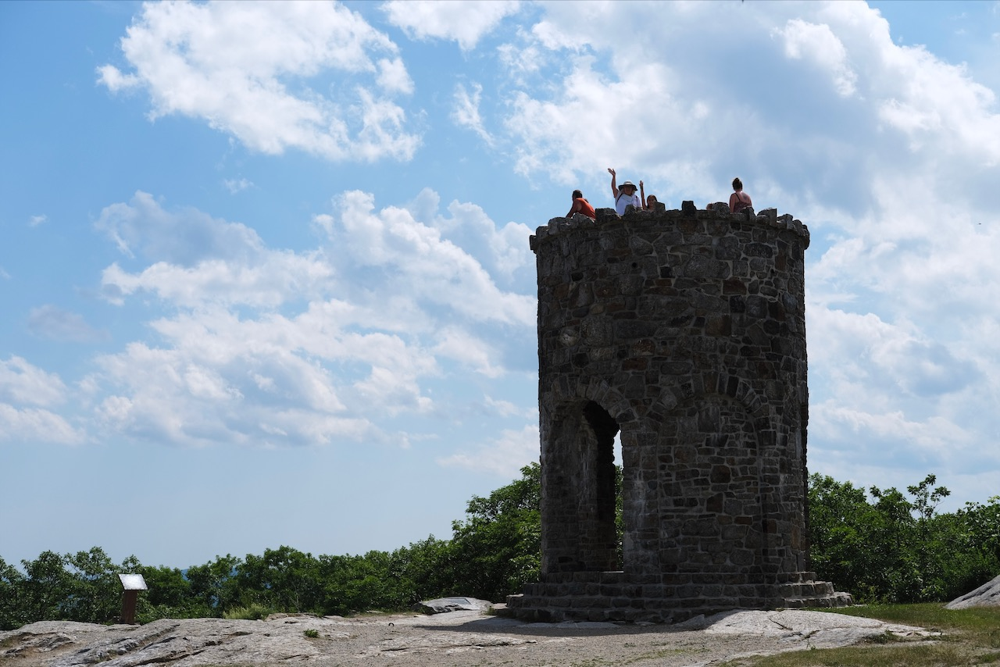
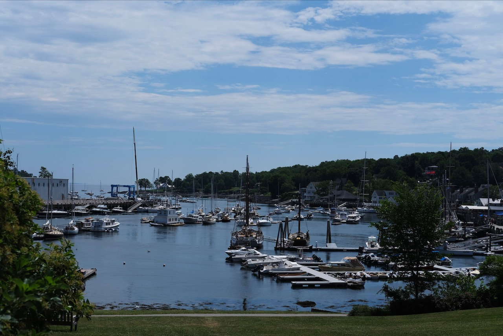
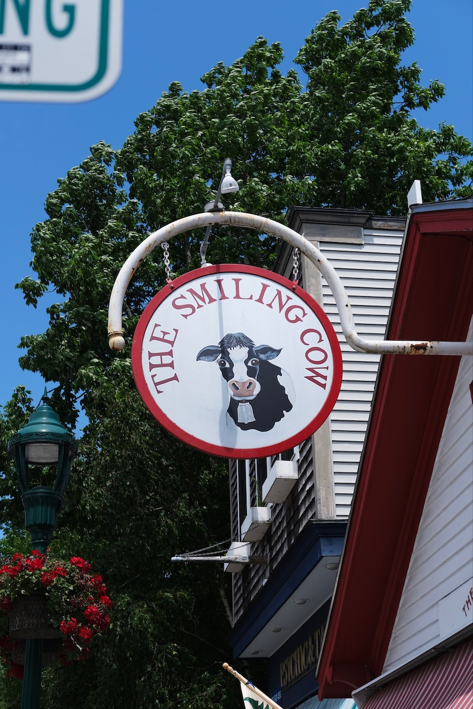
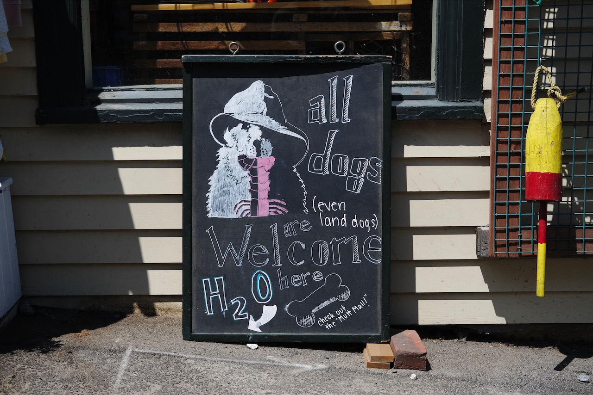
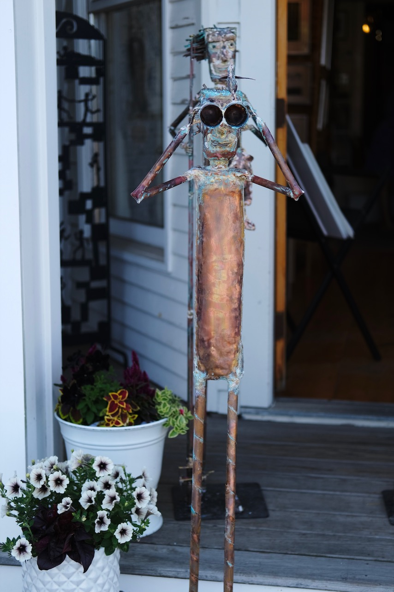
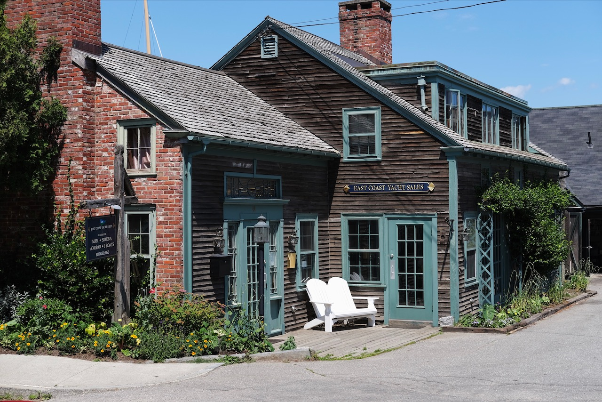
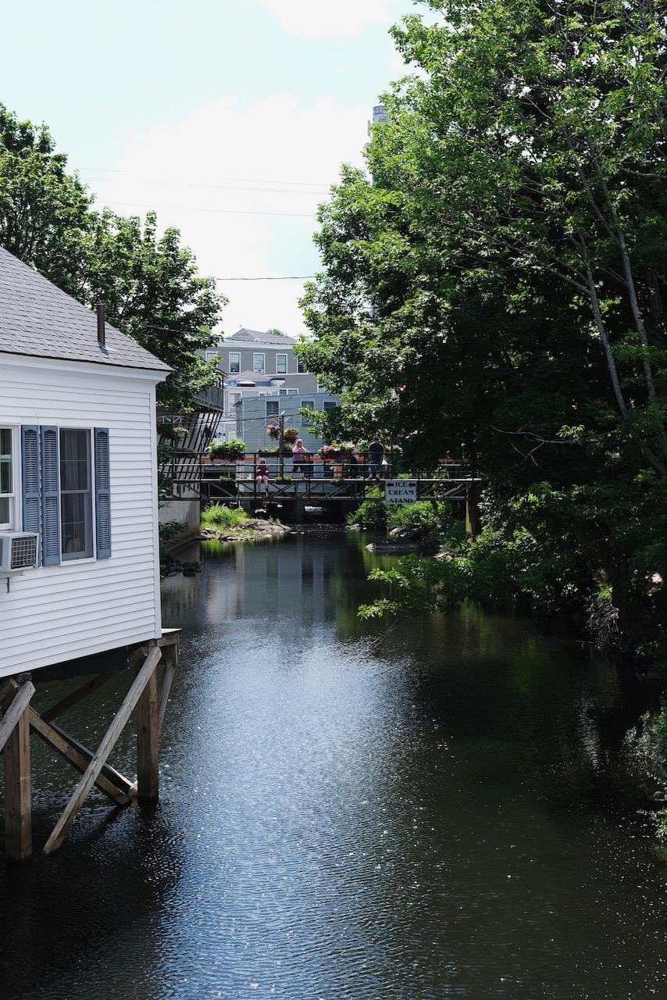
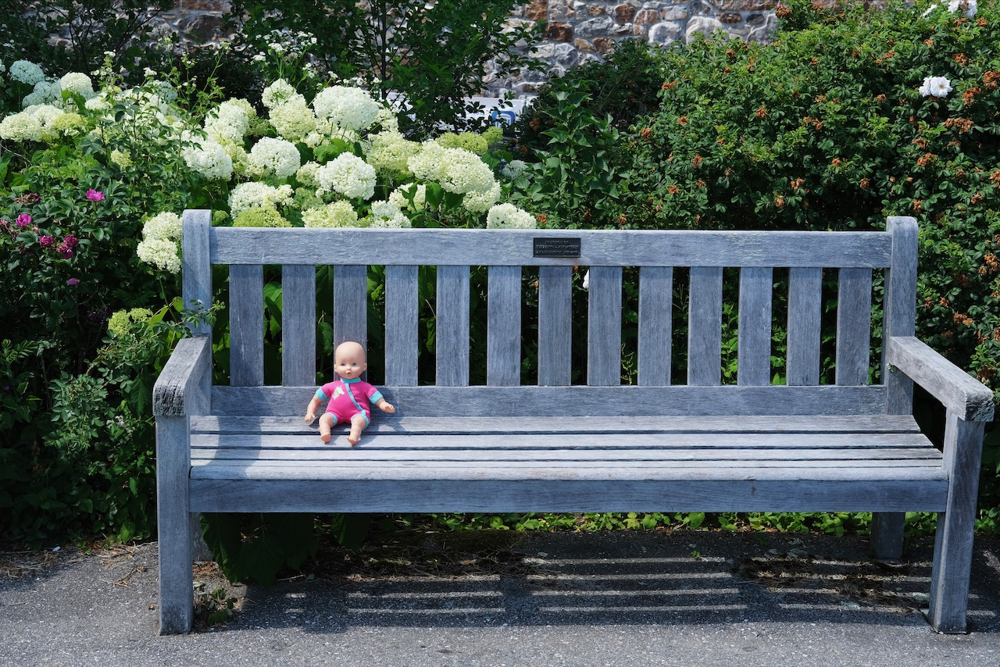

{.cinemascope}

Yesterday we stopped in Camden for lunch and then drove up Mt. Battie (it was too hot to walk up the trail). I took a series of photos for the panorama above, which I stitched together in Affinity Photo[^1]. The view was so expansive I felt like I could see the earth curving at the horizon line.

{.cinemascope}



* {.glightbox}
* {.glightbox}
* {.glightbox}
* {.glightbox}
* {.glightbox}
* {.glightbox}
* {.glightbox}



[^1]: First time trying out the panorama stitching feature, but I like the result better than the in-camera result I typically get from my Fuji, or from my iPhone.