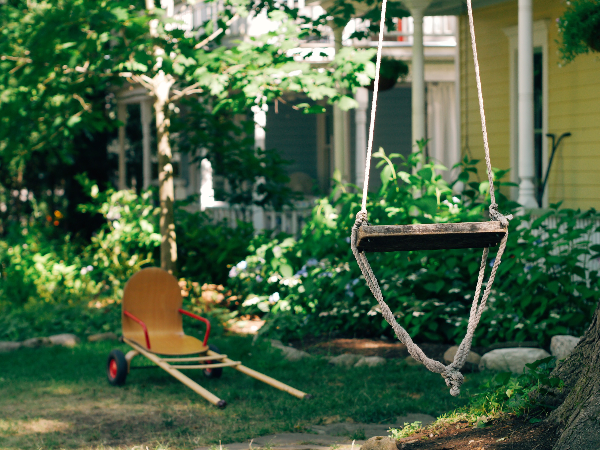
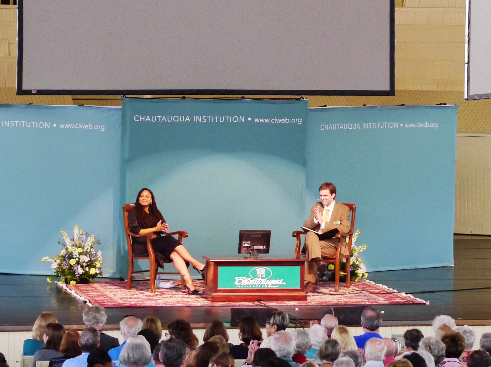
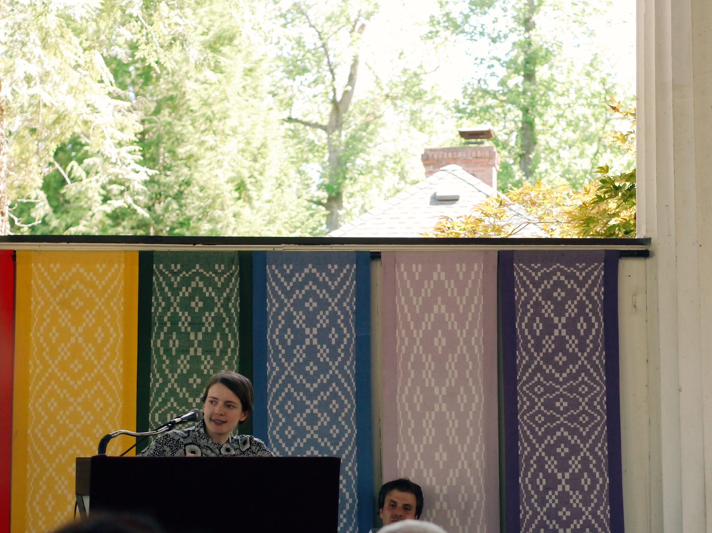
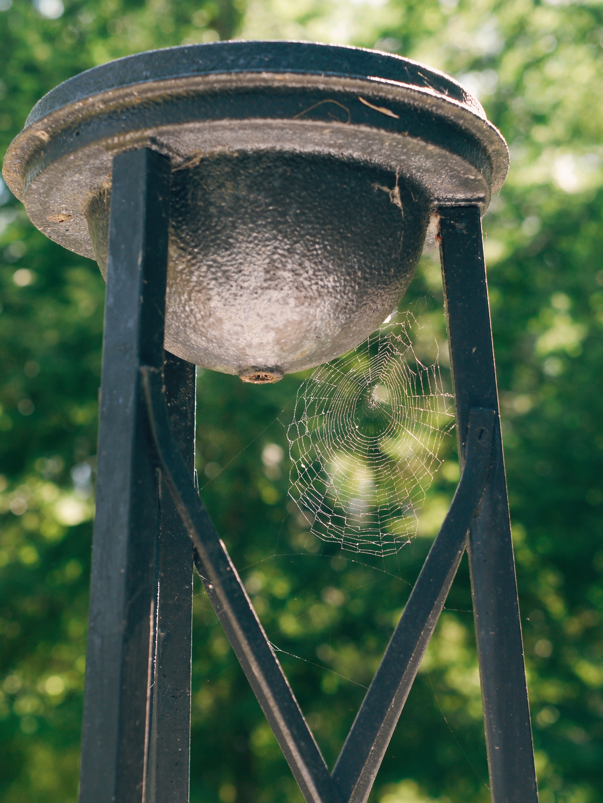
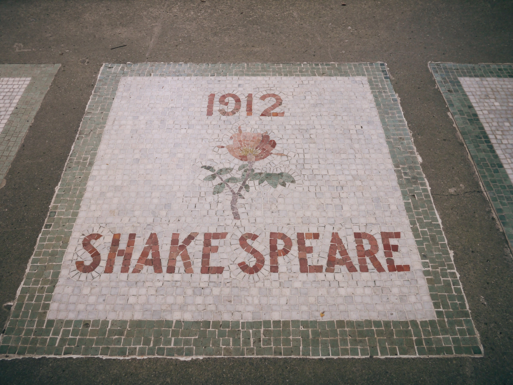
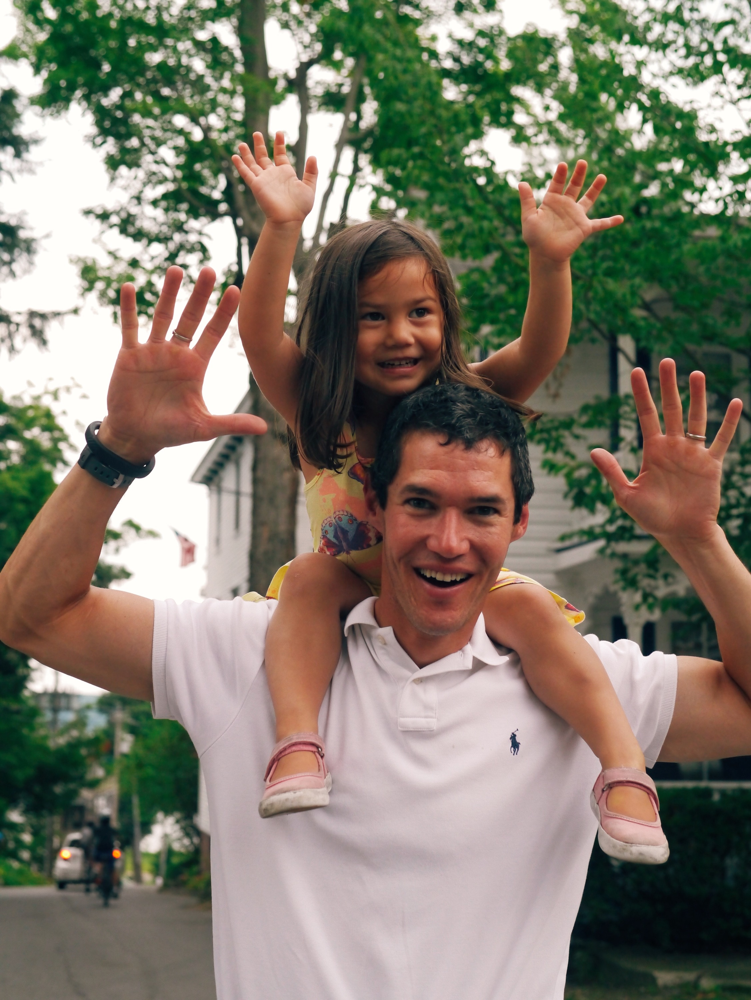
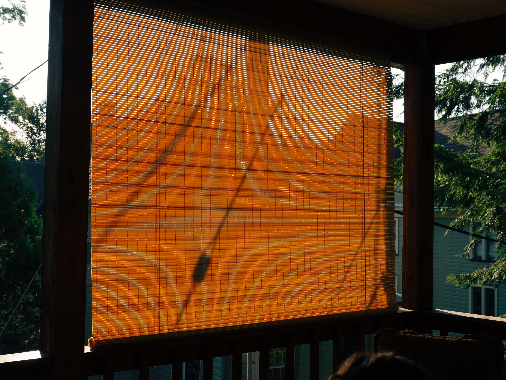
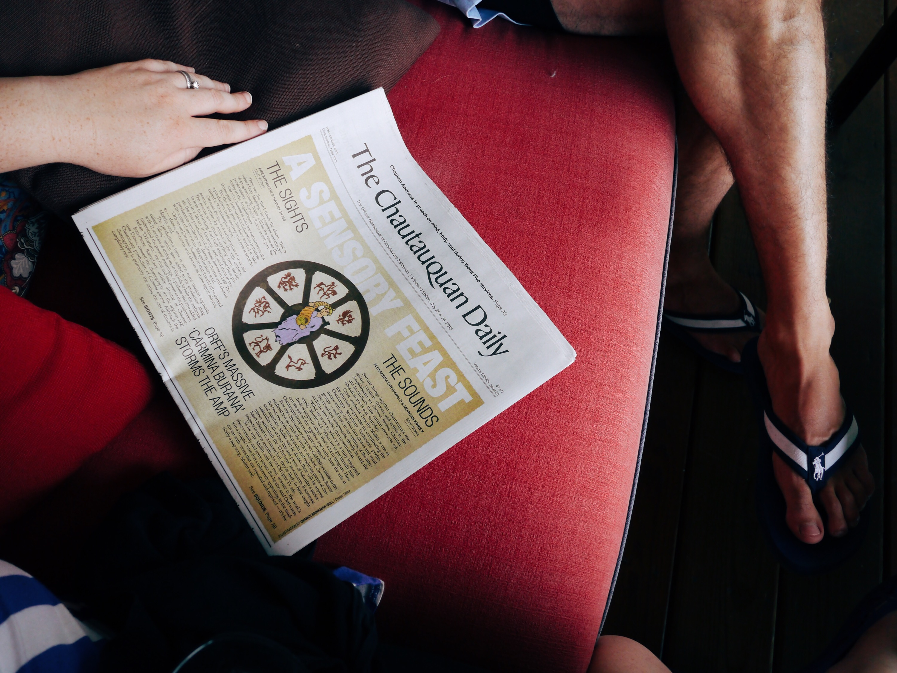

{.cinemascope}

Last month we spent a week at Chautauqua, NY, as guests of my parents-in-law Mike and Debbie. Amelia and Sophie took part in camp; I worked all week but took time out to attend a few lectures. It’s hard to describe Chautauqua, this [NY Times article](http://www.nytimes.com/2014/07/20/travel/an-edification-vacation.html) does a pretty good job.

## Ava DuVernay

One of the early-morning lectures (or simply the “10:45” in Chautauqua parlance) I attended featured “Selma” director Ava DuVernay. It was a Q&A format with one of the Chautauqua staff, and she was funny, incisive, and unapologetic about fighting for an artist’s vision. Numerous times she talked about making things for “the audience of one” instead of worrying about mass appeal. A few things I noted:

- They didn’t have the licensing rights to Dr. King’s speeches, so she rewrote the ones that were used onscreen. She said it was challenging being Dr. King’s speechwriter.
- This was the first movie to feature Dr. King as the central character. Ever. Which seems unbelievable to me.
- Financing started out in Europe, and she got final cut before Paramount picked it up.
- Her family is from Selma, and that allowed her to skip a lot of the research into the town since she already knew it well.
- She made an argument that we should spend less time clamoring for token POCs in stories from white artists, and instead try to empower POCs to tell their own stories. Which I agree with, to a point. I am all for artistic integrity, but I also feel like a lot of entertainment is by committee, and not auteur-driven. And in those cases I’d like to see more POCs, to normalize their presence in even the most banal of narratives.
- She’s working on a virtual-reality project, and made the point that she felt it was important to get in the door at the beginning of what could be a watershed moment for film’s next evolution, instead of getting shut out for decades as early women directors were.
- She talked about the importance of centering the narratives on non-white characters (and thus trying to avoid the trap of white characters who move the story along). She surmised that this is what a lot of the LBJ flap was about—that he wasn’t the central figure.
- She made an interesting point about the male directors and screenwriters who dealt with Dr. King’s infidelity, saying that men wanted to depict the actual infidelity. But as a woman she was more interested in what he said to his wife when he went back home after the infidelity.

## Emily St. John Mandel

The other lecture I attended was given by Emily St. John Mandel, speaking about her novel, *Station Eleven*. She talked a bit about its genesis, and about genre fiction (specifically post-apocalyptic fiction). A few notes:

- She didn’t want to write another “literary noir” book like her first three, so originally she planned to write about an actor’s life going from town to town in Canada.
- Once she got the idea to set it in a post-apocalyptic world, she ended up with the major theme of, “What will we miss the most?”
- She describes it as a love letter to this current world, set in a place where a lot of what we take for granted has been lost.
- She described various stages of research—from trawling survivalist message boards to delving into pandemics. The idea of a pandemic was practical, because she didn’t want to use a nuclear incident.
- She got into how she decided to have the traveling performers only do Shakespeare, and how Shakespeare was born in an era of plague fears, and whose life was marked tragically by the plague.
- The use of Shakespeare was also to find something that would remain when other things had fallen away. She originally had them performing things like Mamet plays and “Seinfeld” and “How I Met Your Mother” episodes, but decided that didn’t work, that people wouldn’t be yearning for those kinds of works.
- The actor-dies-on-stage opener came out of an oral history of the NY public theater, a throwaway reference to an actual incident like that.
- She said had she known it would be in a wave of post-apocalyptic books she would have written something else.
- She brought up a number of reasons why the genre is so popular, in particular that doomsday scenarios allow us to imagine acts of heroism in bad times, to imagine ourselves as rising to the occasion. It is a chance for redemption.
- She also brought up another theory, that we live in a time where there is nothing left to be discovered. There is no Northwest Passage in our imaginations, the world has been mapped. So a post-apocalyptic world is one of uncertainty.
- She brought up how, in a way, the world has always seemed on the brink of destruction. Her parents were fearful of bringing kids into a Cold War-world. But she said flip side to that is that the world has thus always been renewed with each generation. That’s a hopeful thing, that we can find a way through.

## Pockets of time

In between work I took walks with Jordan, biked with Em to her afternoon camp, and took a lot of photos.

## Slowing down

I think next time I’ll leave the work at work, though. The WiFi connection at the house hovered between 3G and DSL speeds; it was an eye-opening reminder of how sluggish the modern web has become (more on that later). The additional delay to work actions left me frustrated and underscored the feeling of being there but not fully present.

A lot of the photos I took are [on Flickr](https://www.flickr.com/photos/dirtystylus/albums/72157654561136753).
