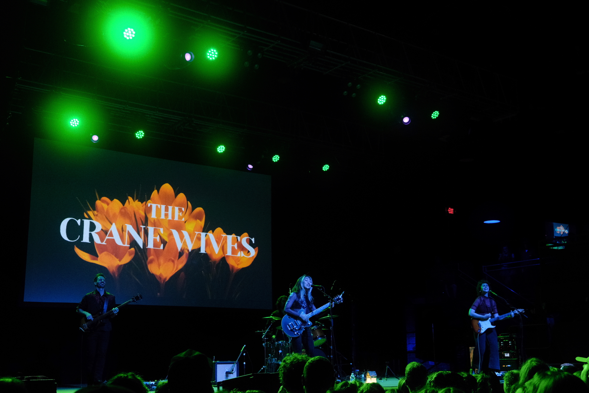
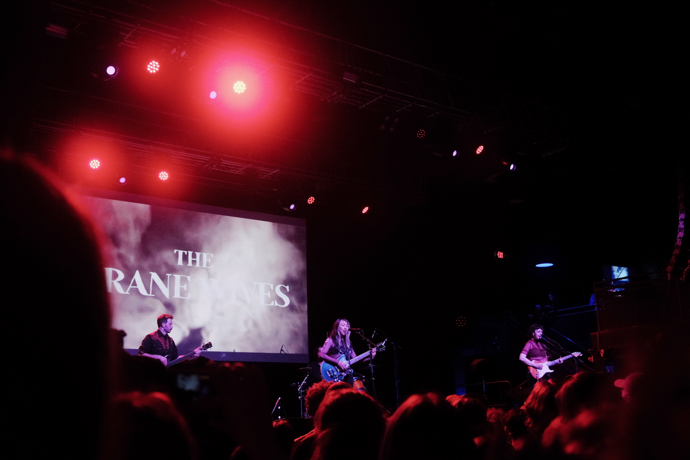
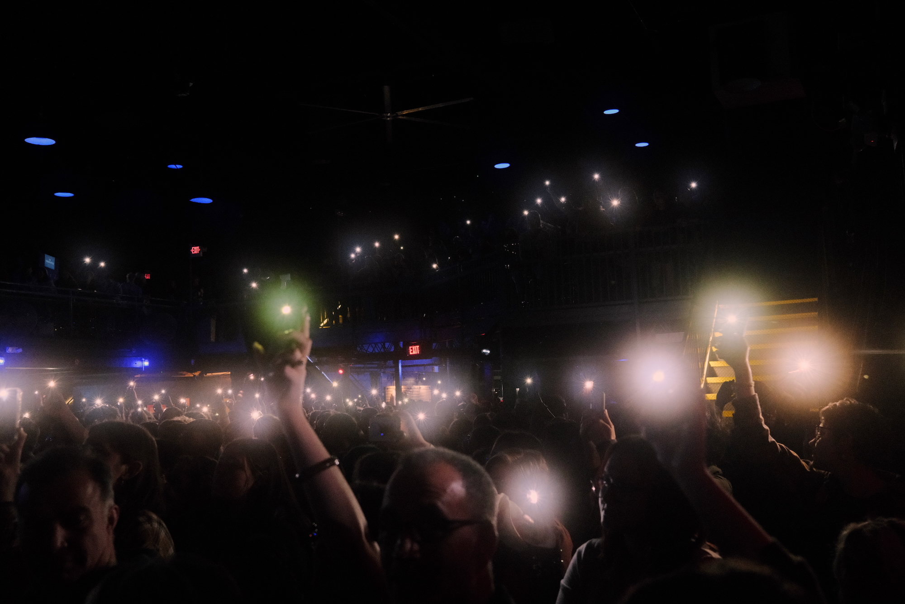
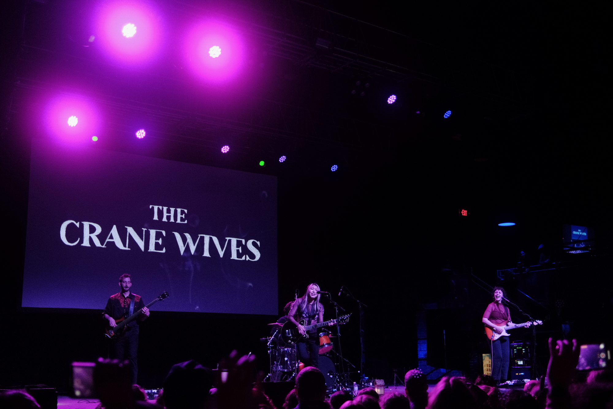

Backfilling from the spring: we went to see Em’s favorite band, The Crane Wives, during their tour stop on May 9 at Philadelphia’s Franklin Music Hall (FKA Electric Factory).

{.cinemascope}

{.cinemascope}

Lots of fun shooting this with a Moment 10% Cinebloom filter. The halation of the concert lights gives the photos a bit more drama, and I love how waving cellphone lights look like a field of fireflies.

{.cinemascope}

{.cinemascope}



