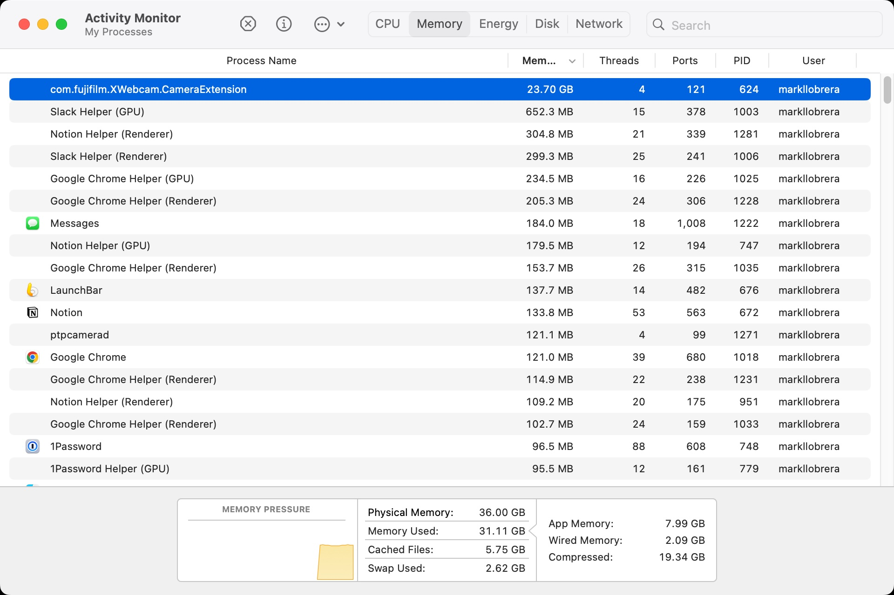
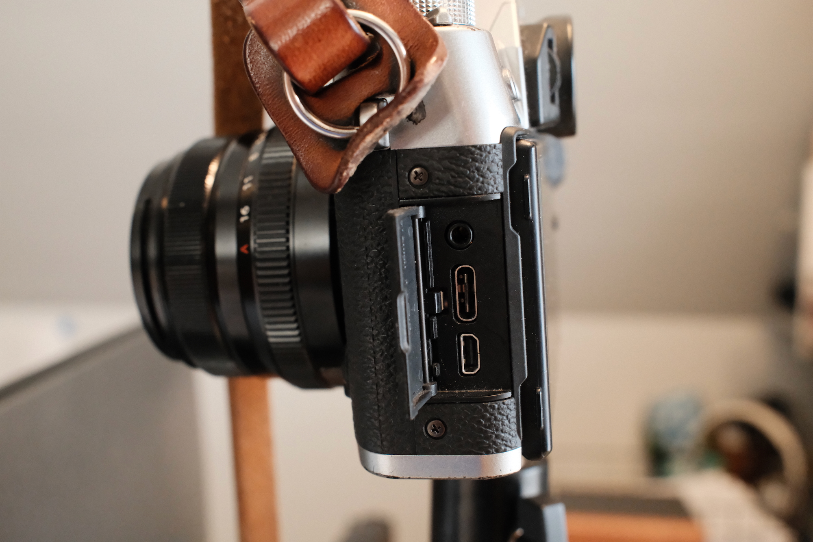
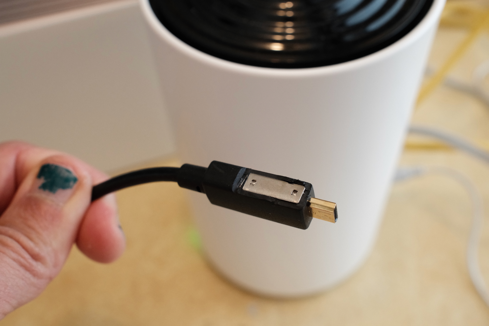
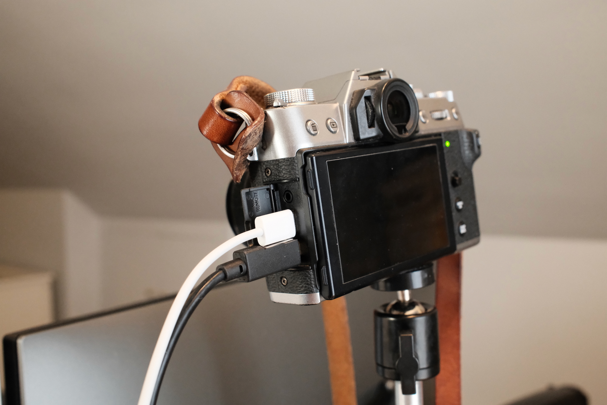

I’ve written about my [office camera setup](/posts/fujifilm-xt30-webcam/), but with my recent move to Upstatement came a new work computer and a few wrinkles. The setup still generally worked, except I noticed video freezing/failing on occasion. Restarting Zoom would not fix things, but a computer restart would. So I took a look at the memory usage for the Fujifilm Webcam utility and *holy memory leak, Batman*:

{.cinemascope}

For a while I got around this by force-quitting the com.fujifilm.XWebcam.CameraExtention process, then restarting the Webcam app. Which quickly grew annoying.

So: back to capture cards as a workaround. I picked up the [Elgato Cam Link 4K](https://www.elgato.com/us/en/p/cam-link-4k). It required a few changes in my setup. The main one was I now had to use the micro HDMI (type D) connector on the camera, so I would now need to route two cables from my camera (one for power/charging, and the other for the video feed itself). There’s not a lot of room between these ports on my X-T30:

My fears were confirmed when I tried hooking up a USB-C cable and a micro HDMI one—they wouldn’t fit together. So, a little bit of surgery:

The result:

Things have been ok in actual use. Unlike the Fujifilm Webcam software, the Cam Link is just a pass-through, so I had to configure my camera output to be clean HDMI (no on-screen display) and I now have to remember to switch off my camera when it’s not in use (the Webcam software would let my camera go to sleep if it wasn’t being used for video). But at least my computer doesn’t grind to a halt after back-to-back video calls.

Newer Fujifilm models (like my X100VI) don’t seem to need the Fujifilm Webcam software—they get recognized as video cameras by the OS/software, so if you have a newer model you just need to set it to [USB Webcam in the connection mode](https://app.fujifilm-dsc.com/en/manual/x100vi/connections/webcam/#gsc.tab=0).
