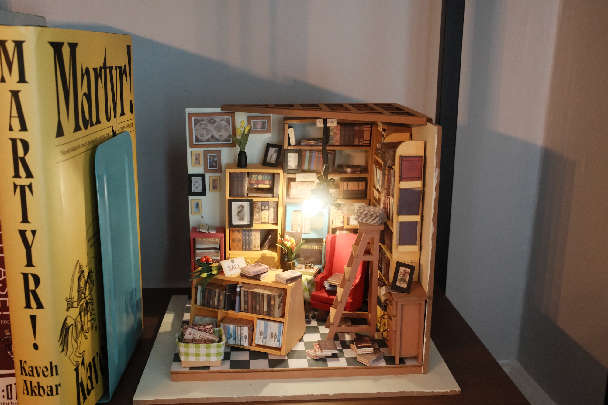

{.cinemascope}

Em and I started working on this miniature study/library model project way back in early 2023. We’d make some furniture, glue together some books, and then several weeks would pass before we picked it up again.

After we put together the big furniture pieces (which included upholstering the red wingback chair) we spent a long time making books. The majority were box-like “books by the foot”-type illusions, but some had pages that you could flip through.





The other major hurdle was wiring up the chandelier. It took us several months to strip tiny wire, connect it, wrap sections in heat-shrink tubing, hook it up to a battery switch, and mount it to the ceiling…and in the end only two of the four bulbs would turn on (`:sad-trombone:`).

In the model, as in real life, we had more books than available shelving.





