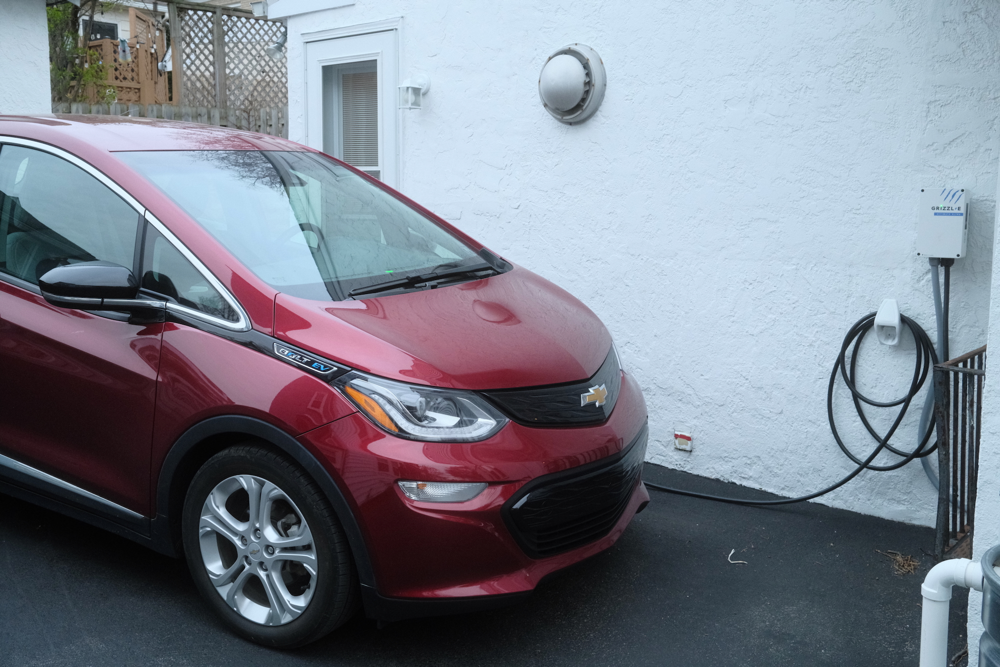

{.cinemascope}

Since 2008 my family and I have been a single-car household. We went through a series of sedans, then bought a minivan in 2018 when the kids’ ballet and soccer carpools turned into multi-kid drives. My eldest is now at an age where they can get their driver’s license, so last fall we started thinking about getting a second, smaller car. The idea was to find something low-cost, efficient, and reliable. I started by looking at hatchbacks and small sedans, like the Honda Fit and Mazda 3. 

In the meantime my brother had been exploring fully-electric vehicles and got a [Chevy Equinox EV](https://www.chevrolet.com/electric/equinox-ev), and while doing research he encouraged me to look at used EVs. There aren’t many smaller EVs on the market — you can thank the USA’s thirst for ever-bigger SUVs for that. That meant looking at older models like the Nissan Leaf, Chevrolet Bolt, and the original Hyundai Ioniq sedan.^[All of these models have been discontinued, although the Leaf and Bolt are coming back, and Hyundai has turned the Ioniq into a fuller lineup.]

Used EV prices ended up being in the same ballpark as conventional gasoline cars, so we started focusing on EVs and in January we found a 2020 Bolt with fewer than 25,000 miles on it. We had our electrician hook up a level 2 charger in our driveway,^[A Grizzl-E Ultimate 48A model. I figured the Canadians would know something about building a weatherproof charger.] and we joined the ranks of EV drivers.

A few notes/observations:

* We use the Bolt for most of our driving now. The van is used for long trips, hauling lots of people/stuff, or the rare occasion when both Jordan and I both need to drive at the same time.
* We gas up the van about once every 4 – 6 weeks now. Our electrical bill has increased slightly in response, although I haven’t done the math on how much we’re saving per mile switching from gas to electric.
* Home charging eliminates range anxiety for regular driving. I don’t think too much about the battery level, because it’s always charged within a few hours. Plug it in overnight and it’s ready in the morning.
* We haven’t used it on a long trip, so I don’t know how quickly (or slowly) it charges at a DC charging station. I imagine we will get a NACS (Tesla) adapter if we ever feel like using it for something other than local drives, just for flexibility with charging options.
* Cold weather reduces range, sometimes to the tune of 15 – 20%. Range is somewhere between 215 – 240 miles in moderate temperatures, but in the coldest weeks of February that was closer to 170 – 180.^[We follow the recommendation to only charge the batter to 80% to prolong lifespan.]
* No more oil changes, so I’m looking forward to visiting the mechanic less. Basically brake/alignment checks, fluid top-offs, and wiper blade swaps, some of which I can do at home.
* Plastic is the overriding interior aesthetic on this Bolt. I imagine that newer models include a little bit more luxury, now that the underlying battery/engine tech has matured and takes up less of the overall production cost.
* It’s fun to drive! It is small and lightweight, so speeding up/slowing down really feels like a go-kart. Flip it into the regen/one-pedal mode and it approximates the feel of downshifting a stick shift into a lower gear, especially on a winding road.

The biggest change for me is future-looking. The EV industry is facing legislative headwinds for the next several years, but I don’t think we’re going back to gas vehicles. I’m pretty sure my next vehicle would be an electric.

