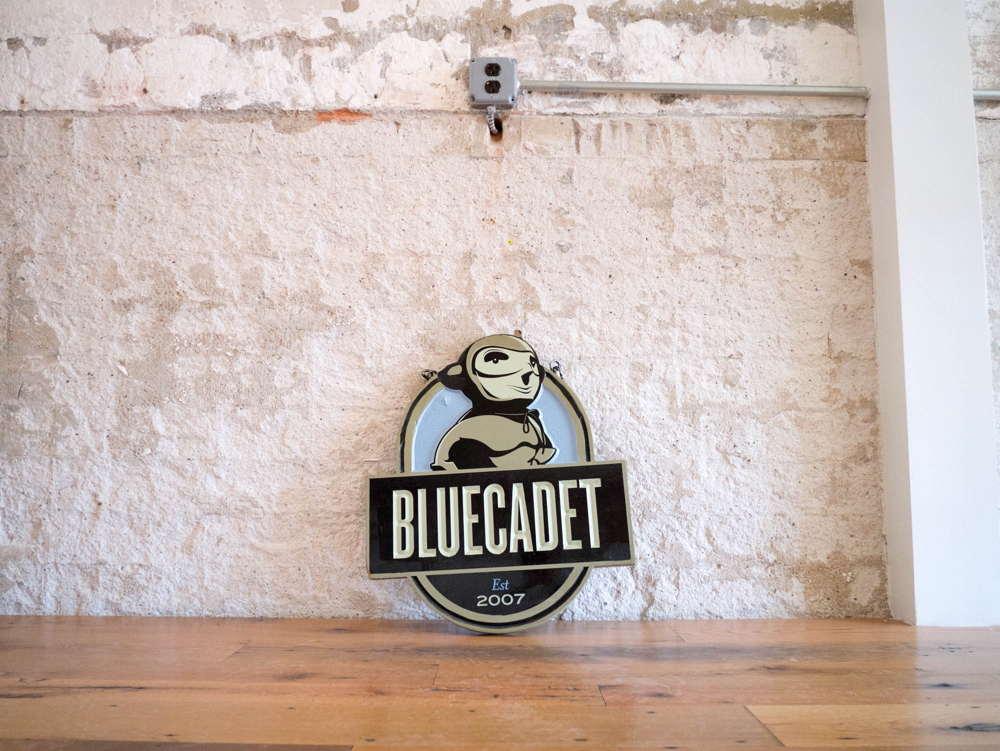
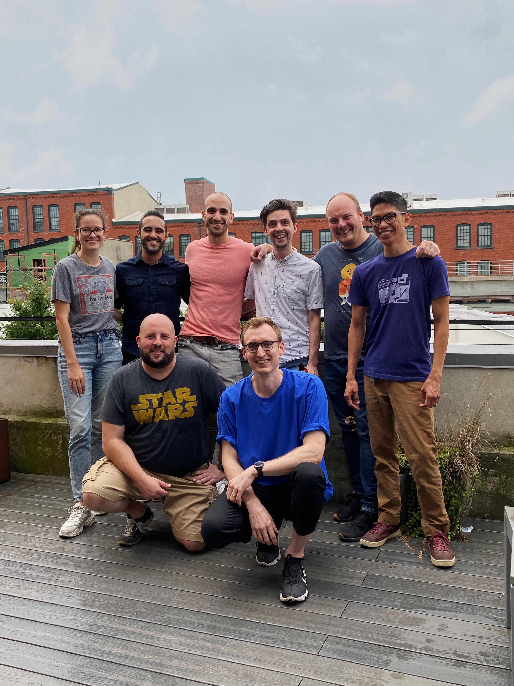

{.cinemascope}

How do you say goodbye to a place?

At the end of September I worked my last day at Bluecadet, the agency that’s been my professional base for the last 11+ years. It’s where I got to take my first steps into engineering leadership, moving from a senior developer role to tech director, and then later head of technology. I got to see the studio grow from a scrappy collection of about a dozen people to an established presence in the experience design world. I’ll always be grateful to Rebecca Sherman, Josh Goldblum, and Troy Lachance, for bringing me on to the team.



Alex and Stacey having fun during a walkthrough of the future Fishtown office in 2013 (no audio). [*Full version on Flickr*](https://flic.kr/p/e8PygL).



Over the years I’ve gotten to work on so many different kinds of [projects](/work)—small websites like [Lapham’s Quarterly](https://www.laphamsquarterly.org), massive rebuilds for organizations like [WHYY](https://whyy.org), and transformative digital projects for the Smithsonian Air and Space Museum. I got support from my team when [writing about process](https://alistapart.com/article/prototyping-your-workflow/) and giving [talks](https://markllobrera.com/work/#talks) about our approach to building things. All of that output rested on top of work I got to do with a special group of kind, talented people. 

Nearest to my heart: I got to help build a team of developers around a spirit of curiosity, generosity, and inclusion. So much of our department’s culture had a ripple effect on the broader agency and that—more than any single project—is what I’m most proud of during my time at Bluecadet.

As luck would have it Bluecadet’s annual [agency retreat](https://www.flickr.com/photos/dirtystylus/albums/72177720321289531) was the week before my last day. In these times of remote work it felt like a gift to spend two days hanging out and saying goodbye.

Going through old photos has brought on a wave of nostalgia: a [cookout at the old Northern Liberties office](https://flickr.com/photos/dirtystylus/albums/72157634189688386/), many different [Pi(e)](https://flickr.com/photos/dirtystylus/albums/72157649065899363/) [Days](https://flickr.com/photos/dirtystylus/albums/72157666755309918/), [ChampionChip](https://flickr.com/photos/dirtystylus/albums/72157652374339191), [Gingham Day](https://flickr.com/photos/dirtystylus/albums/72157644637769968), and [so much more](https://flickr.com/photos/dirtystylus/albums/72157632296738155/). To everyone who crossed paths with me: thank you. I’ll see you around.
