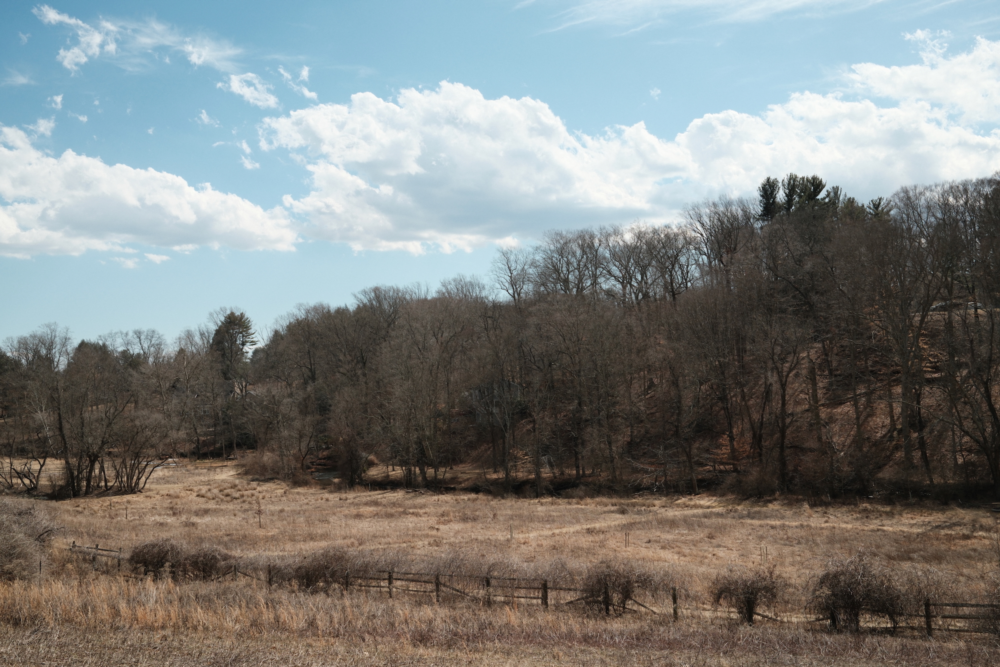

{.cinemascope}

Last week I packed up my Fujifilm X100S and sent it off to a new owner. I’d had the camera just shy of ten years, the longest of any digital camera I’ve owned. I put up with its slow and inaccurate autofocus, its weird noise reduction at high ISO, and a broken power switch courtesy of a spilled cocktail. It’s been the closest thing I’ve shot to a digital Canonet, as I [wrote](/posts/fuji-x100s/):

> When I stopped shooting film I kept wishing for something very specific—basically a digital version of my Canonet QL17: small body, small lens with a fast aperture, built-in viewfinder.

## The X100VI

A year ago I put in an order for the X100VI, a mere six hours after it was announced. And then…I waited. And waited. Fujifilm is notorious for being unable to keep up with demand for their cameras, so I figured it would take a couple of months. It ended up taking eleven.

Now that I’ve had a month to shoot with it I can finally put down some impressions.

Good things:

* The autofocus is faster and more reliable. I really don’t think about it at all, which is a relief
* There’s in-body stabilization, which helps for shooting video, or shooting at really slow shutter speeds
* Everything feels built to tighter tolerances: all of the dials and switches feel more precise than on the X100S
* It’s got weather sealing—I’ve taken it out in falling snow and light rain without worrying about it

Annoying things:

* The Fujifilm menu system is (still) byzantine and makes it really hard to set up the camera
* You really need to use the fastest SD card you can find. I originally thought that I had a faulty camera because it was so slow to start up…until I swapped one of my class class 10 cards for a different one.
* Battery life isn’t great…budget for an extra battery or two if you shoot a lot
* I wish there was a lock on the eyepiece diopter adjustment dial—it gets easily moved when you carry the camera in a bag
* It supports HEIF files, but right now support for HEIF in MacOS is a little bit [inconsistent](https://george.black/2024/issues-with-apple-photos-and-fuji-x100vi-heif-images/)

Overall it really feels purpose-built for taking photos and using them right away. Right now I’m shooting RAW+JPG to give a little flexibility for reprocessing files, but as I get more familiar with the different film simulation recipes I can see myself going jpeg-only except in the most challenging situations. I’ve been using the jpegs with only minimal adjustments to brightness (Darkroom’s different [masking options](https://darkroom.co/blog/2022-04-masks) allow me to make selective edits to jpeg files where I’d previously rely on a RAW file).

## Film Simulations

My X100S came with 6 film simulations (9 if you count the Y/R/G variants of the B&W mode). The X100VI comes with 14 (20 if you count the B&W variants). But I haven’t even tried any of the newer film simulations, because I went straight to [FujiXWeekly](https://fujixweekly.com) and pulled a few different ones to try.

So far I’ve been leaning on three:

* [Reggie’s Portra](https://fujixweekly.com/2022/06/11/fujifilm-x-trans-iv-film-simulation-recipe-reggies-portra/)
* [Tri-X 400](https://fujixweekly.com/2020/06/18/fujifilm-x100v-film-simulation-recipe-kodak-tri-x-400/)
* [Pro Negative 160C](https://fujixweekly.com/2024/03/27/pro-negative-160c-fujifilm-x100vi-film-simulation-recipe/)

The process of loading these recipes into the camera’s custom settings banks is pretty annoying, although you can speed things up somewhat by setting up the My Menu options, as explained in [this video](https://www.youtube.com/watch?v=-LV3TpHmj9M). Even then, it’s still a bit confusing to me whether I’m altering something for that custom settings bank, or globally.

### Reggie’s Portra

This is probably the film recipe I’ve used the most—it’s got a warm tone and some good contrast, and does fairly well indoors and outdoors.

{.cinemascope}

{.cinemascope}

### Tri-X 400

I’ve been reaching for this when I feel the need for some B&W—the grain emulation gives it a bit of grit.

{.cinemascope}



* {.glightbox data-gallery=gallery2}
* {.glightbox data-gallery=gallery2}



### Pro Negative 160C

This one might have too much of a reddish cast, especially indoors, so I’m still trying it out on different subjects.

{.cinemascope}



* {.glightbox data-gallery=gallery3}
* {.glightbox data-gallery=gallery3}
* {.glightbox data-gallery=gallery3}
* {.glightbox data-gallery=gallery3}
* {.glightbox data-gallery=gallery3}
* {.glightbox data-gallery=gallery3}
* {.glightbox data-gallery=gallery3}
* {.glightbox data-gallery=gallery3}



## Accessories

At present I’ve only grabbed two: a [Mightykillers wrist strap](https://www.mightykillers.com/shop/camerope-d2-pj7y6-tkte4), and a low-profile [NiSi UV filter](https://nisiopticsusa.com/product/nisi-nc-uv-filter-ii-for-fujifilm-x100-x100s-x100f-x100t-x100v-x100vi-silver/) that serves to weather-seal the camera. I am considering a [Cinebloom filter](https://www.shopmoment.com/pages/cinebloom-diffusion-filters) (although I find it funny that after the early years of digital fixated on a sharp and noise-free image, we’re now actively trying to find ways to soften our images or add digital grain using film simulations).

## Parting Thoughts

Photography is in a really interesting moment. Now that output from phone cameras has gotten objectively excellent, it feels like many folks are connecting with older processes of capturing an image—film photography, for sure, but younger folks are also [scouring eBay for vintage digicams](https://www.nytimes.com/wirecutter/blog/vintage-compact-point-and-shoot-camera/). I had hoped that the runaway success of the X100 line would spark more high-end compacts from camera makers, but so far that hasn’t happened.^[I had also hoped the [Leica Q3 43](https://leica-camera.com/en-US/photography/cameras/q/q3-43-black) would have a lower-profile lens, but alas.] When people ask me if they should get an X100-series camera, I ask them: is this how you’d like to shoot (fixed-lens, dedicated dials, a viewfinder)? If not, there’s probably better (and less expensive) choices out there.

For me, though—it’s nice to have a fully-realized version of what my X100S hinted at ten years ago. All of my major nitpicks have been addressed—from operation to output—and while I still have quibbles, they fade away when I’m shooting.
