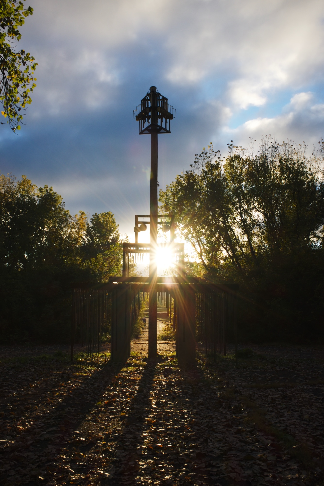
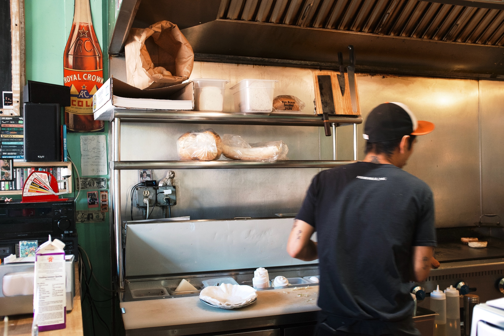
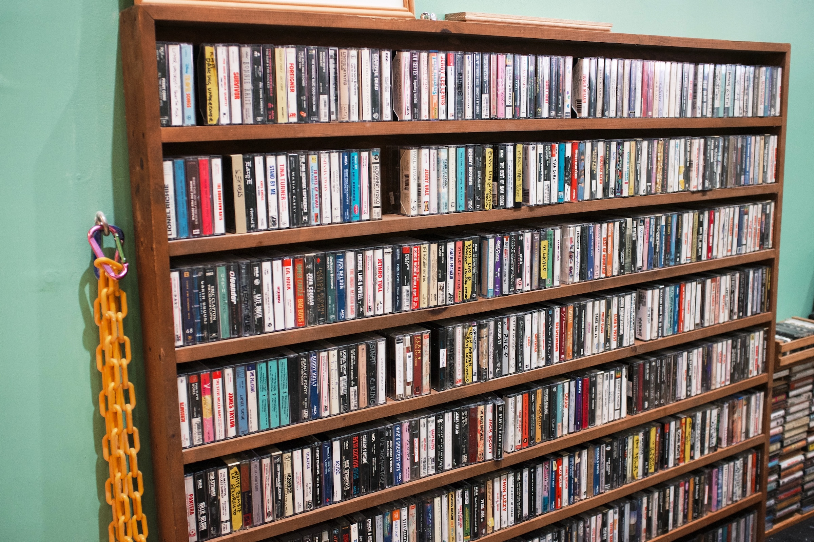
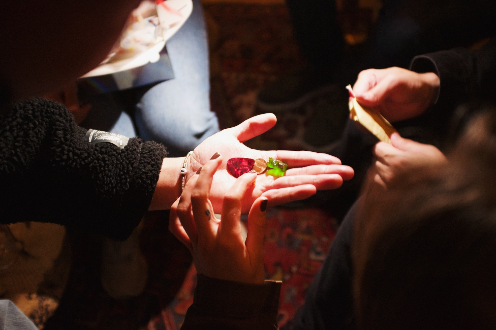
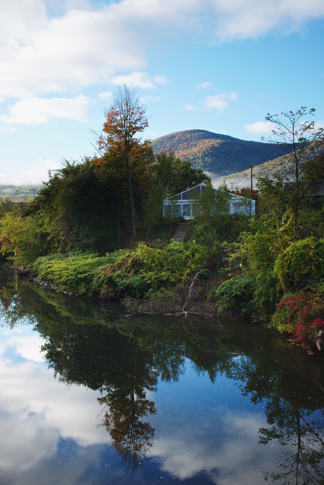
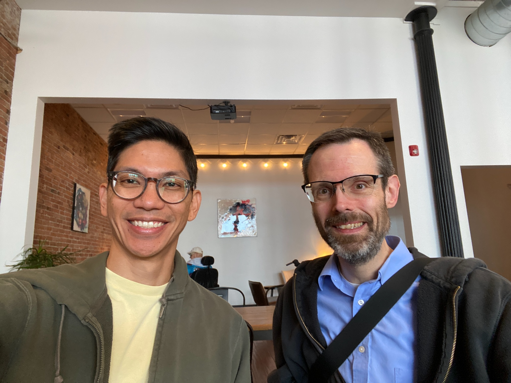

I’ve started a new role at [Upstatement](https://upstatement.com), joining their team as a Senior Engineering Director. It’s a big change in one regard—I had been at [Bluecadet](https://www.bluecadet.com) for [nearly twelve years](/posts/goodbye-bluecadet). At the same time there’s some built-in familiarity: it’s an agency setting, has roughly the same number of people, and some similar types of clients. I’m excited to dig in.

The timing worked out really well because my start date was right around the annual Upstatement Summit (should that be UpSummit™?), so I got to spend a couple of days in North Adams, MA, meeting my new teammates in person. 

Getting there was relatively smooth: I flew out of Philadelphia into Albany, and drove an hour east. I stopped for a brief moment in Troy to grab a bite at Naughter’s. They had a big cassette tape collection that was feeding the sound system.

The Summit was a mix of workshops and downtime, including a multi-round game of trivia that featured objects, clues delivered via [Cameos](https://www.cameo.com), and puzzles. Everyone was very welcoming, and I got a valuable peek into the agency culture.

I had to leave before the final day, but on my last day I took a short sunrise walk in some really nice light.

Bonus: flying out of Albany meant a rare chance to see my college roommate Ben, who lives in the areas. It’s probably been over twenty years since I’ve seen him in person, and I had a great time catching up over coffee in downtown Troy.

More photos on [Flickr](https://flickr.com/photos/dirtystylus/albums/72177720321268775/).
