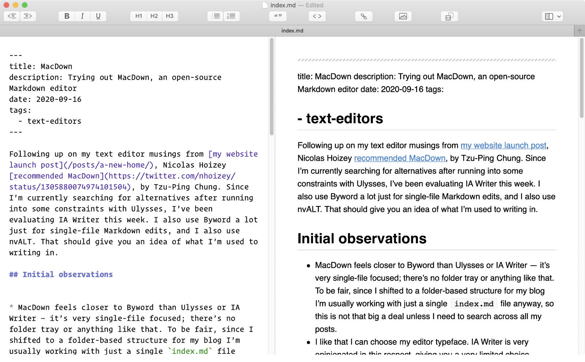
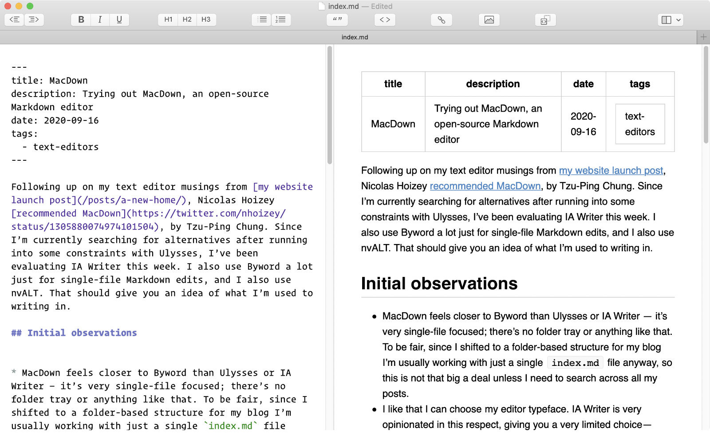
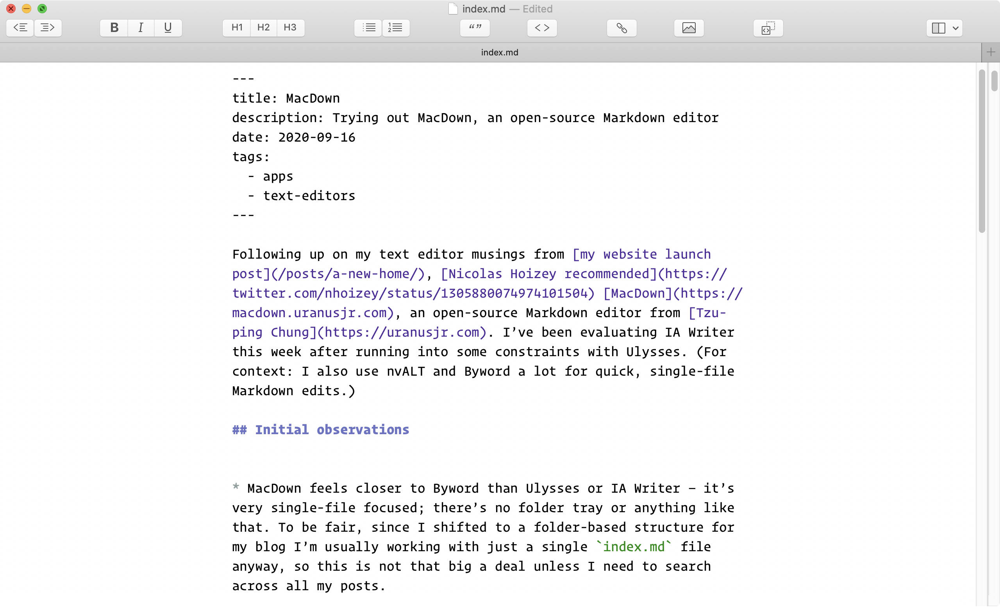

Following up on my text editor musings from [my website launch post](/posts/a-new-home/), [Nicolas Hoizey recommended](https://twitter.com/nhoizey/status/1305880074974101504) [MacDown](https://macdown.uranusjr.com), an open-source Markdown editor from [Tzu-ping Chung](https://uranusjr.com). I’ve been evaluating [IA Writer](https://ia.net/writer) this week after running into some constraints with Ulysses, but I’m also quite partial to projects that are labors of love—MacDown apparently came to life after [Mou](http://25.io/mou/) ceased development. (For context: I also use nvALT and Byword a lot for quick, single-file Markdown edits.)

## Initial observations

* MacDown feels closer to Byword than Ulysses or IA Writer — it’s very single-file focused; there’s no folder tray or anything like that. To be fair, since I shifted to a folder-based structure for my blog I’m usually working with just a single `index.md` file anyway, so this is not that big a deal unless I need to search across all my posts.
* I like that I can choose my editor typeface. IA Writer is very opinionated in this respect, giving you a very limited choice of three (!) custom-designed fonts.
* It seems to be much less aggressive with auto-saving, compared to IA Writer. (If you’re working in IA Writer and running an Eleventy local server which watches for changes, you can see it re-building frequently.)
* The MacOS-level text replacements didn’t seem to work at first. For example, I have a shortcut for the YAML front matter block mapped to `;post`. I had to select the shortcut text and then MacDown asked whether it wanted me to replace text automatically. After that it behaved more like I was used to in other programs.
* The preview pane defaults to updating as you type, and it flashes when updating, which is *very* distracting. If you type fast it turns into a strobing/flickering mess. In contrast the IA Writer preview pane is rock solid.
* It’s a different key to show the preview pane than to hide it, which…shouldn’t this be a toggle? For now I’ve turned off the auto-updating, and just hit Command+R to update the preview.
* Even if you hide the preview pane, it’ll show up whenever you open a new document. Wish that were sticky to however I set it last.
* The preview pane will render images wrapped in `<figure>` but `<figcaption>` content is not displayed.

## Front Matter

MacDown’s startup screen touts Jekyll front matter support, which presumably would support Eleventy’s YAML front matter. But it’s not enabled by default, so I was a little confused when I dropped in a quick attempt:

{.cinemascope}

Turns out in the Rendering section of the preferences there’s a checkbox “Detect Jekyll front-matter”, which results in a much more pleasant table rendering of YAML:

{.cinemascope}

This is still better than what I’ve experienced in IA Writer, which doesn’t render the YAML block at all.

## Finding the balance

If IA Writer is very careful and particular—but rigid—in its design decisions, then MacDown is way more open to tinkering with the editor experience. My early negative reaction to the default editor view melted away after I spent some time tweaking the preferences—setting a maximum editor width is *immensely* helpful, for starters: 

{.cinemascope}

I suppose it comes down to whether I feel like the preview pane behavior is a dealbreaker. (To be fair, with Eleventy and Browsersync maybe I should just treat the browser output as a slightly-delayed preview.) I’m going to keep trying both out for a few more days and see where I land.

(You can [download MacDown here](https://macdown.uranusjr.com).)
