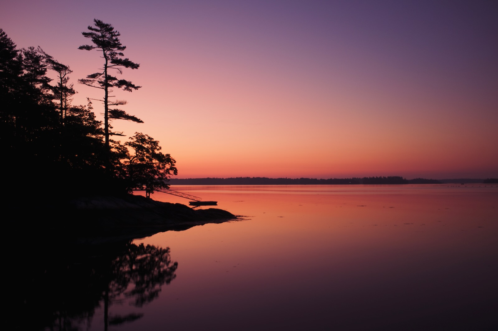
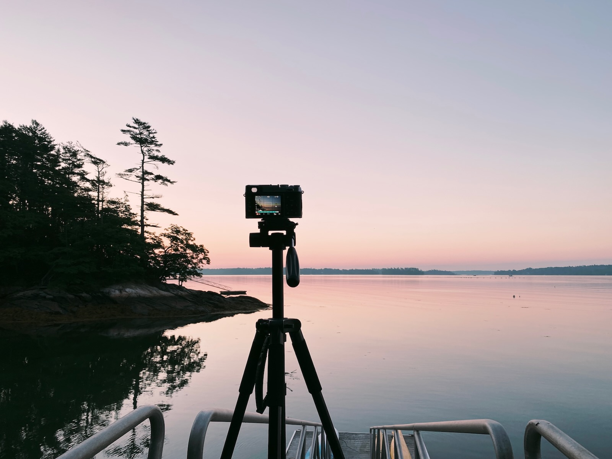
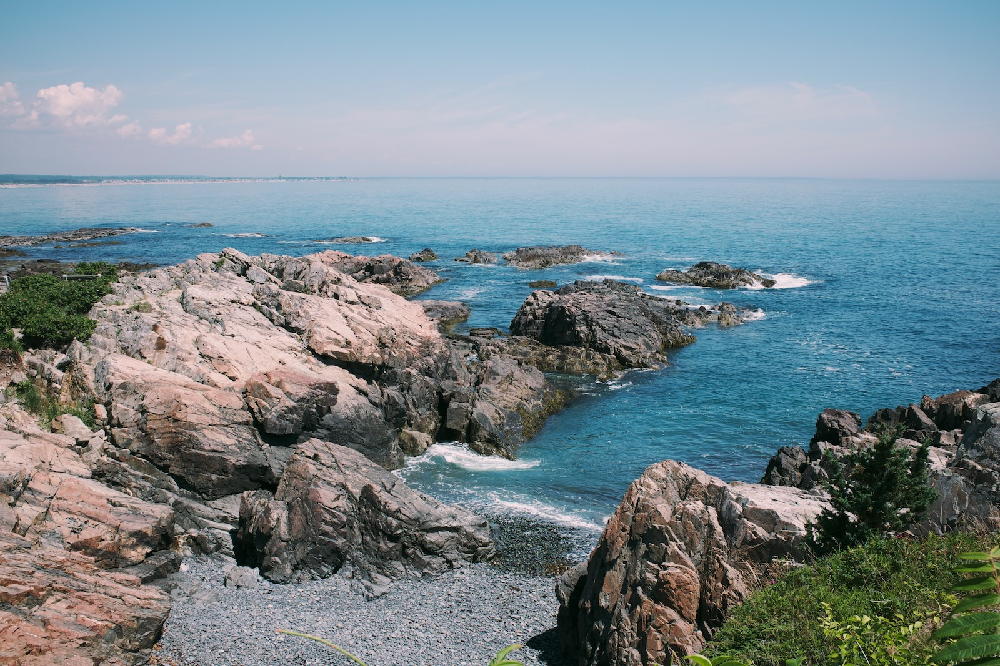
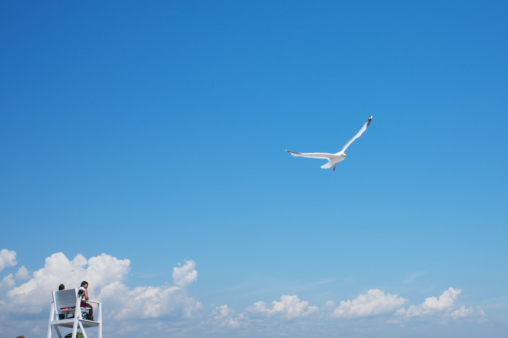
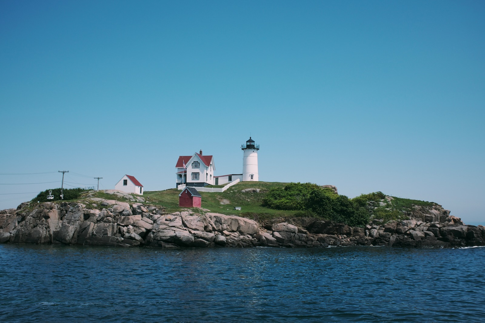
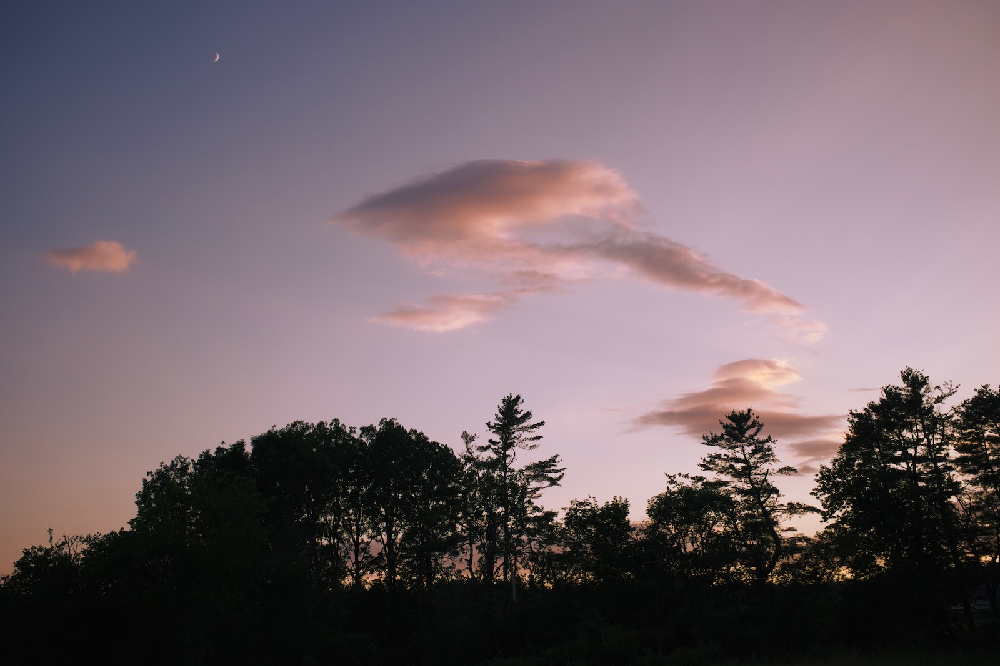
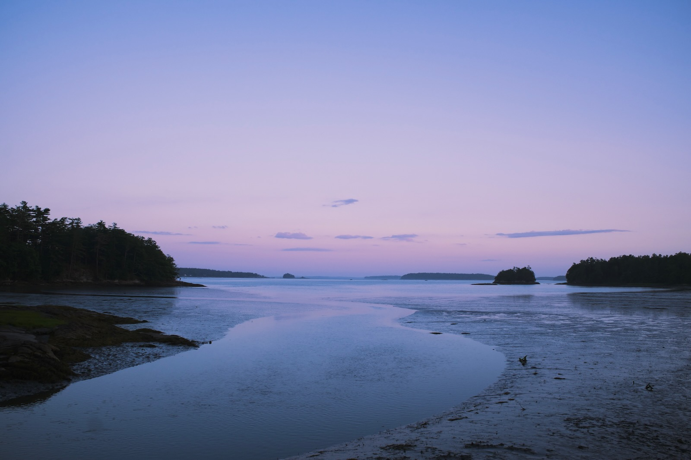
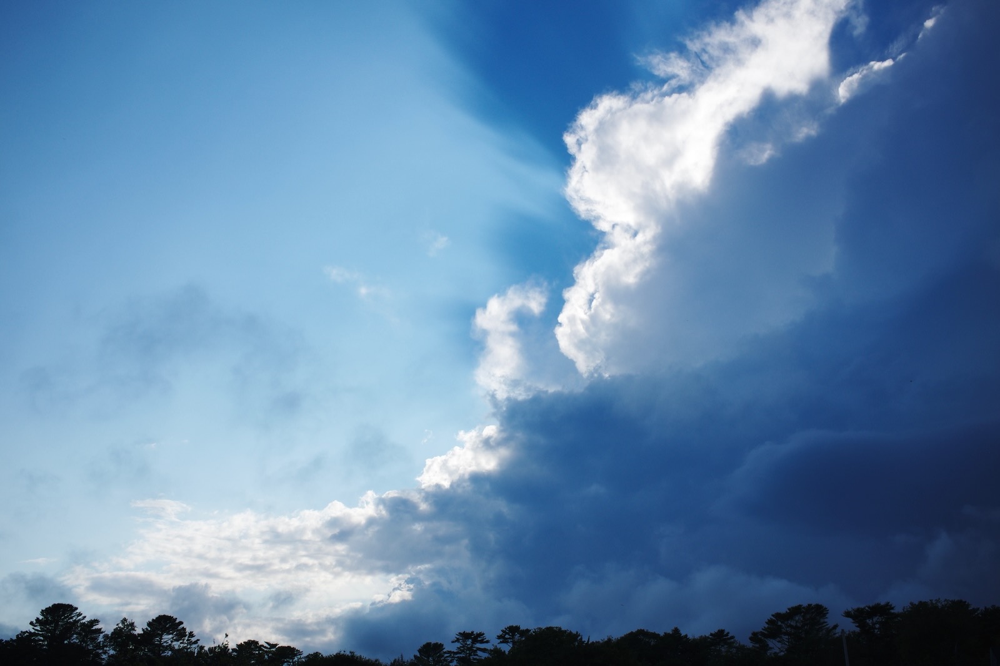
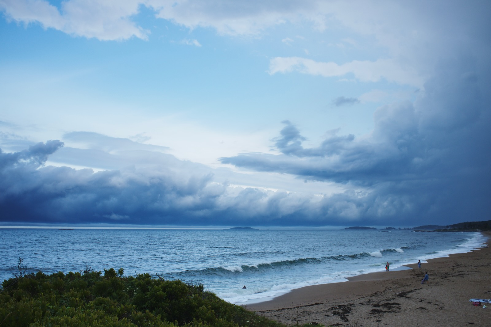

{.cinemascope}

In early July we made our annual trip up to Maine, staying near Wolfe’s Neck Woods State Park outside Freeport. Besides the Covid year in 2020 we’ve managed to gather there with Jordan’s parents and sisters for the last eleven years, and it’s become a tradition that’s going to be part of my kids’ memories for a long time.

I got up early to catch the sunrise for the photo above, setting up my tripod by the shore down the hill from the house where we stay. There were a lot of bugs out, and the mosquitoes seemed particularly attracted to the heat coming off my camera. 

We saw a few new places this trip: early on we took a trip to Ogunquit and took a walk along the Marginal Way Walk, which had some lovely views of the coast.

{.cinemascope}

{.cinemascope}

We also made a quick stop south of Ogunquit to see the Nubble Lighthouse, which is just as cute as its name.

{.cinemascope}

But really this trip was all about the skies for me:

{.cinemascope}

{.cinemascope}

{.cinemascope}

{.cinemascope}

[More photos on Flickr](https://www.flickr.com/photos/dirtystylus/albums/72177720319055456).