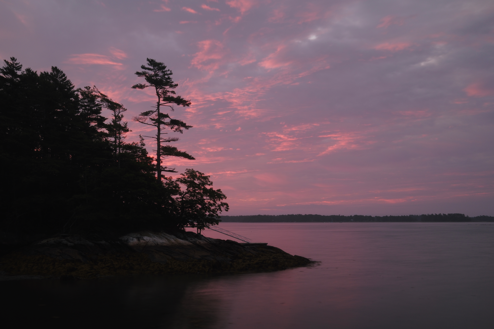
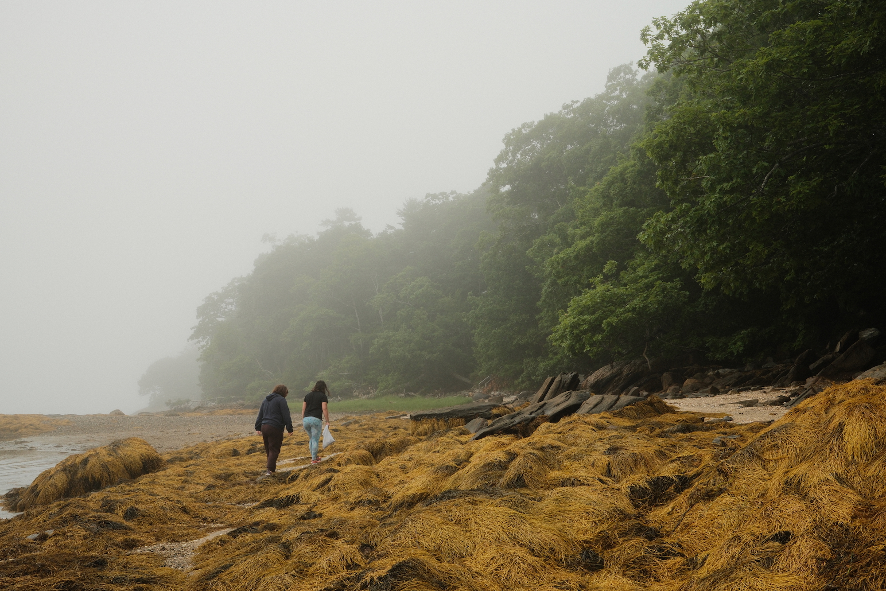

The family and I spent our traditional early-summer week in Freeport, Maine. I’m glad I got up early the day after arrival to grab a sunrise photo, because the fog rolled in later in the week and didn’t leave.

{.cinemascope}

These were just test shots with our kids in the garden but we didn’t get light like this again:





Jordan and I ended up taking a few walks when it wasn’t raining, and we saw this lil’ friend hiding near a frog pond:

{.cinemascope}

{.cinemascope}

We had a good meal at [Scales](https://www.scalesrestaurant.com) in downtown Portland.





Also: a [Red’s Eats](https://www.redseatsmaine.com) lobster roll

## A study in fog

The big visual theme: fog. In past years we would often get some early in the morning and it would burn  off during the day. This year it was more of a constant presence. It did make for some very dramatic photos, and I enjoyed using a [Tri-X film simulation](https://fujixweekly.com/2020/06/18/fujifilm-x100v-film-simulation-recipe-kodak-tri-x-400/) for many of these shots. I think I’ve found a good balance of film sims for [my X100VI](/posts/goodbye-x100s-hello-x100vi/).

."){.cinemascope}

Two views of my favorite osprey tree. In the second you can see the fog revealing *just* a peek of the far coast.





{.cinemascope}

We spent one afternoon on the beach at Reid State Park. I messed up the white balance on the second shot but I kept it — it makes me think of the Fremen of *Dune*, waiting to snag a sandworm.





After the beach we went for lobster at [Five Islands Lobster Co.](https://fiveislandslobster.com) just a few miles down the road from Reid.

{.cinemascope}





## Seaglass Hunting

During low tide we’d walk down to the shore and pick seaglass, everyone trying to find the rarer blue/pink varieties.





## Wrapping Up

Em is a rising junior, so in our last few days we squeezed in a campus tour of Bowdoin College, where her aunts and uncles on Jordan’s side all went to school.

Afterwards we stopped in at Maine Beer Company for pizza and to pick up some beer-infused mustard for home.





{.cinemascope}

The way home was marked by thunderstorms — by the time we drove through New York and New Jersey it was clear it was going to be a slog. Parts of the NJ Turnpike turned into a parking lot due to flooding, and we got off at one point to grab dinner and hope it would clear up. Total travel time: fifteen hours. (I was so thankful to my past self for building in a buffer vacation day before returning to work.)

[More photos on Flickr](https://www.flickr.com/photos/dirtystylus/albums/72177720327621864).

