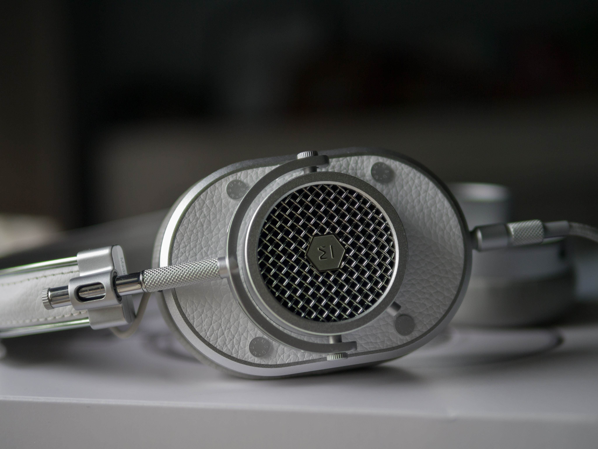

{.cinemascope}

My pair of [Philips Cityscape Downtown](http://www.usa.philips.com/c-p/SHL5605GY_28/citiscape-downtown-headphones-with-mic) gave up the ghost earlier this year. After 3.5 years they were falling apart, with the [faux leather peeling and headband separating](https://www.flickr.com/photos/dirtystylus/24420101311/in/datetaken/), but I kept pushing them until one of the channels finally failed.

So I started searching for new headphones. I decided to focus on over-ear models, instead of on-ears. Here’s a few notes from a three-month search:

- [Fidelio L2](http://www.usa.philips.com/c-p/L2BO_00/fidelio-fidelio-headphones-with-mic): Nice sound, but too much sound leakage in/out.
- [Master &amp; Dynamic MW60](http://masterdynamic.com/products/mw60-wireless-over-ear-headphones?variant=8103518081): Bluetooth that works! Beautiful design. Replaceable earpads. But: heavy and uncomfortable with glasses.
- [B&amp;O H7](http://www.beoplay.com/products/beoplayh7): Bluetooth. Light, reasonably comfortable. Sounds grainy, especially in the upper mids and highs.
- [Sennheiser Momentum 2.0](http://en-us.sennheiser.com/momentum-m2): Good sound. Light, but (surprisingly) not that comfortable with my glasses.
- [B&amp;O H6 (2nd Gen)](http://www.beoplay.com/products/beoplayh6): Sounds good, but the circular earcups mean that with glasses the sound suffers. There’s less padding than the H7, which might explain why that wasn’t as big a problem with the H7s.
- [Oppo PM-3](https://www.oppodigital.com/headphones-pm-3/): Great sound. Clamps a bit too tightly (you can stretch the headband). Not that comfortable around the neck.
- [Master &amp; Dynamic MH30](http://www.masterdynamic.com/products/mh30-on-ear-headphones?variant=10305071239): Tried these, but I liked the MH40 better.
- [Master &amp; Dynamic MH40](http://www.masterdynamic.com/products/mh40-over-ear-headphones?variant=10305011079): These are the ones I ended up keeping. They’re heavy, and the look is a bit too fussy for my liking. The in-line remote buttons are hard to use by feel. But they isolate pretty well, are reasonably comfortable with glasses, and the cord jacks on either side are a nice touch.

My main takeaway from this whole circus is: eyeglasses and over-ear headphones are a tough match. If you can, try headphones on like you would a pair of shoes—order a bunch, try them on for sound/fit, and return the ones that you don’t like. I bought the B&amp;O, Oppo, and M&amp;D models direct, and all have 30-day return policies. Also, try each one out for several days. It’s surprising how different a headphone sounds after your brain has gotten used to it.

The curious thing to me was the comfort difference between the MW60 and MH40. They share the same earpads, but I found the MH40 to be much more comfortable than the MW60. It could be the headband design differences—the MH40’s is a bit rounder, so perhaps that reduces the clamping pressure. It’s a pity, because I wouldn’t have minded paying the extra money for a Bluetooth headphone that actually works and sounds just as good as a wired model. (The MW60 can also be used passively-wired, which is nice for hooking up to my desktop amp.)

In the end, my two favorites were the Oppo PM-3 and the M&amp;D MH40. The Oppo sounded a bit better, but the MH40 just worked better as a commuter/desk hybrid, and were a bit more comfortable with glasses.
