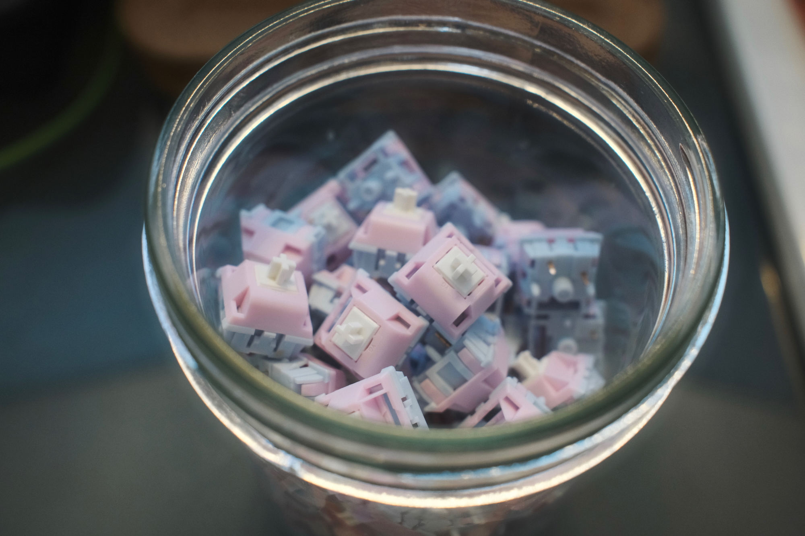
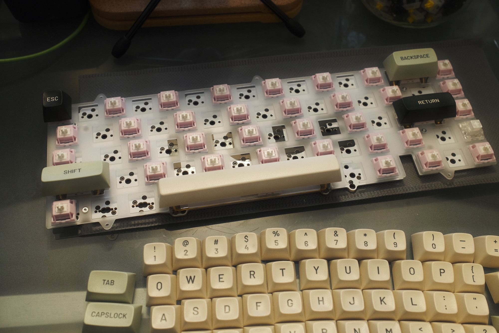
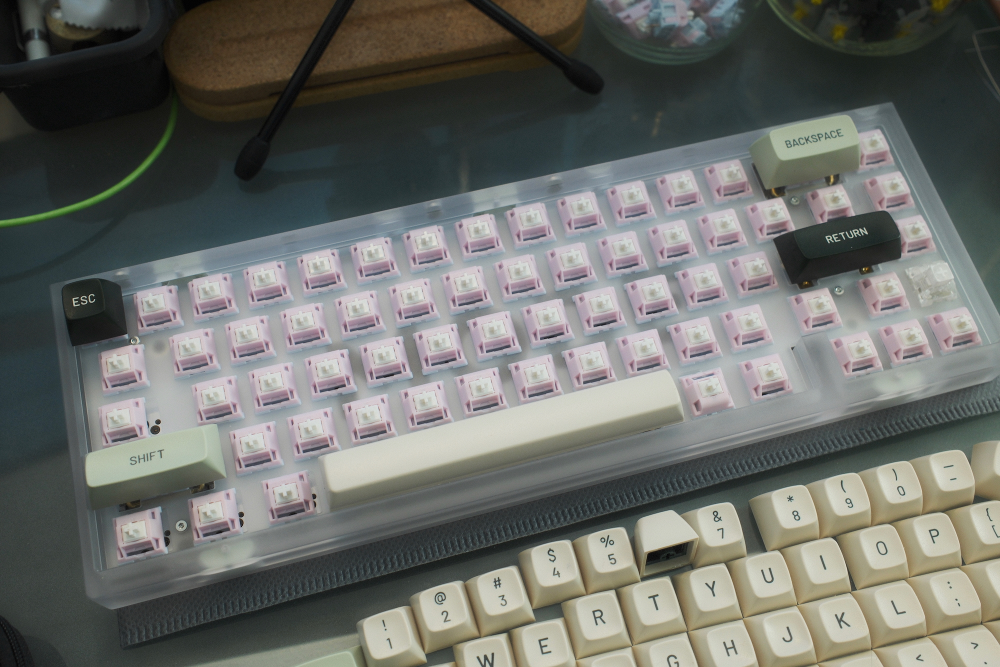
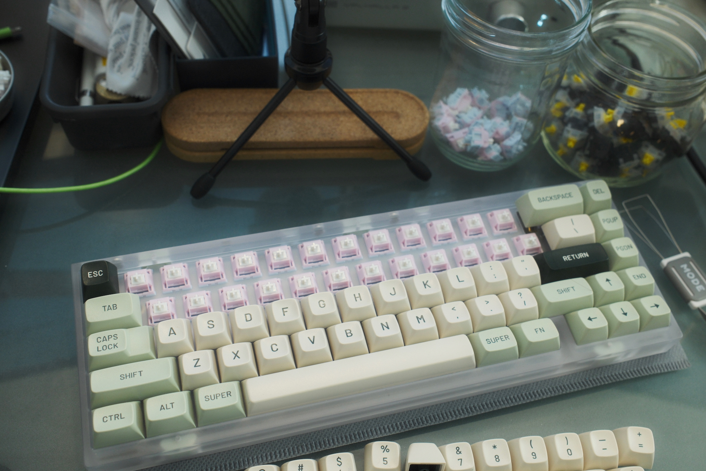
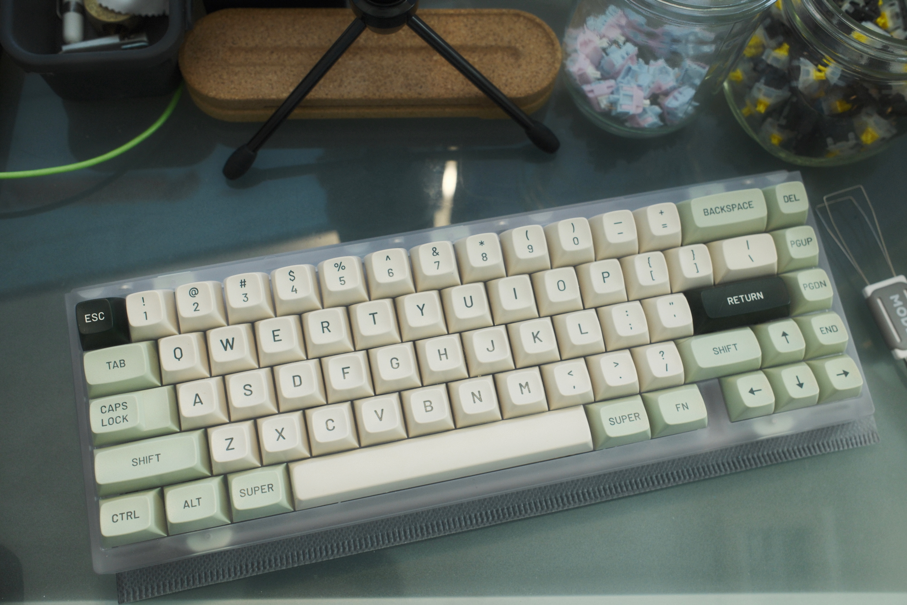
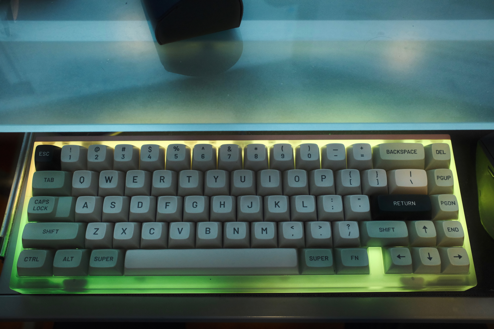

[When I built my Mode SixtyFive](/posts/mode65-2024-keyboard-build/) I used the switches I had on hand — a mix of Gateron Xs, Kailh Box Whites, and (later) a few Boba U4Ts plus a Gazzew Linear Thock for the spacebar. That’s a ridiculous assortment of switches to have in one board, but the main issue was that the Gateron Xs were modded down to three pins^[For my Drop Alt, [way back in 2020](/posts/drop-alt-a-keyboard-makeover/) (ty Max).] and they were quite loose in the plate — pulling up keycaps would often bring the switch with them, and sometimes they created alignment issues with the keycaps where things were slightly askew or I’d get keys rubbing up against each other.

So: new switches were in order, and after listening to way too many sound tests on YouTube I picked up a batch of [Keygeek Keylin switches](https://milktooth.com/products/switches/keylin): linear, fairly light weight in terms of feel, and lower-pitched than the Gateron X.

{.cinemascope}

Overall: the board sounds a whole lot more consistent, the weird keycap alignment issues are fixed (the stepped Caps Lock key was especially problematic), and the lighter spring weight means I don’t have to worry about my RSI flaring up. Not bad for ~$25.

