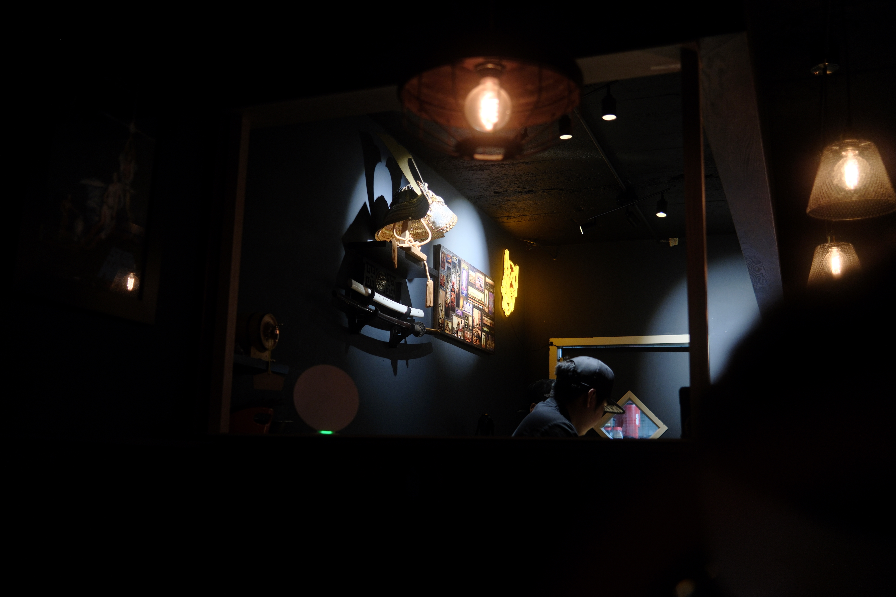
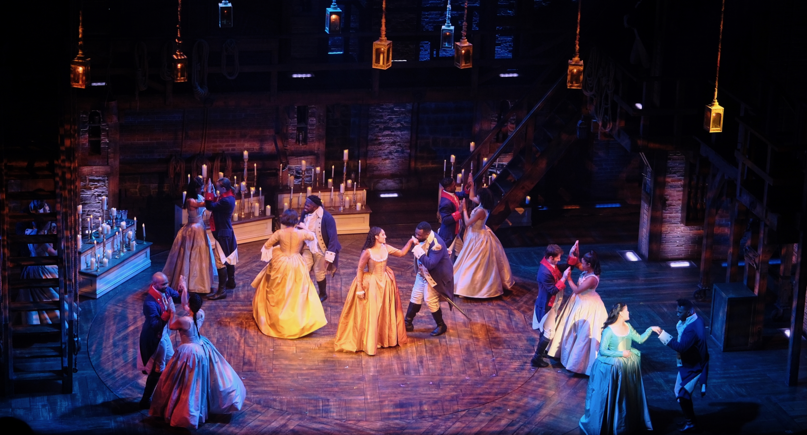

A quick trip to New York City for a 10th-anniversary performance of *Hamilton* and a tour of Pratt in Brooklyn. We drove the Bolt up as an experiment in range and public charging, and I have to report: although it supports DC fast charging, it is painfully slow. That won’t be an issue with newer EVs, but suffice to say we won’t be taking that car on any road trips.

## South Street Seaport

We usually stay somewhere in the Flatiron district but this time we ended up in FiDi. On arrival we grabbed lunch at the Tin Building at South Street Seaport, which is basically a fancy food court with lots of catnip for photographers.

{.cinemascope}





{.cinemascope}





## Union Square

After lunch we took the subway up to Union Square to stop at the Strand and a nearby thrift shop.

{.cinemascope}





## Times Square and Hamilton

A quick pre-show bite at Sake Bar Hagi on 51st, then *Hamilton*.^[I enjoyed reading [Emily St. James on *Hamilton*’s 10th anniversary](https://episodes.ghost.io/hamilton-10th-anniversary/), and the political era it can’t escape.] We had gotten tickets when we heard Leslie Odom, Jr. was coming back to play Aaron Burr, and the crowd was incredibly excited to see him back on that stage.





I appreciated all of the 40 megapixels in my Fujifilm X100VI because I was able to crop some usable photos from way back in the cheap seats. It also made for a discreet way to sneak a few shots in a no-photo performance without disturbing other folks in the audience, with its silent shutter and viewfinder.

{.cinemascope}

{.cinemascope}

## Pratt

I enjoy an early morning in NYC, especially if there’s fog or mist that’s just clearing. Grabbed bagels from a nearby shop (finding a good bagel in the Philly suburbs is hard).





Em is interested in art school so we took a tour of Pratt’s campus, and if she went there she’d end up back in her birthplace of Brooklyn.

{.cinemascope}





{.cinemascope}

More photos [on Flickr](https://flickr.com/photos/dirtystylus/albums/72177720329645988/).

