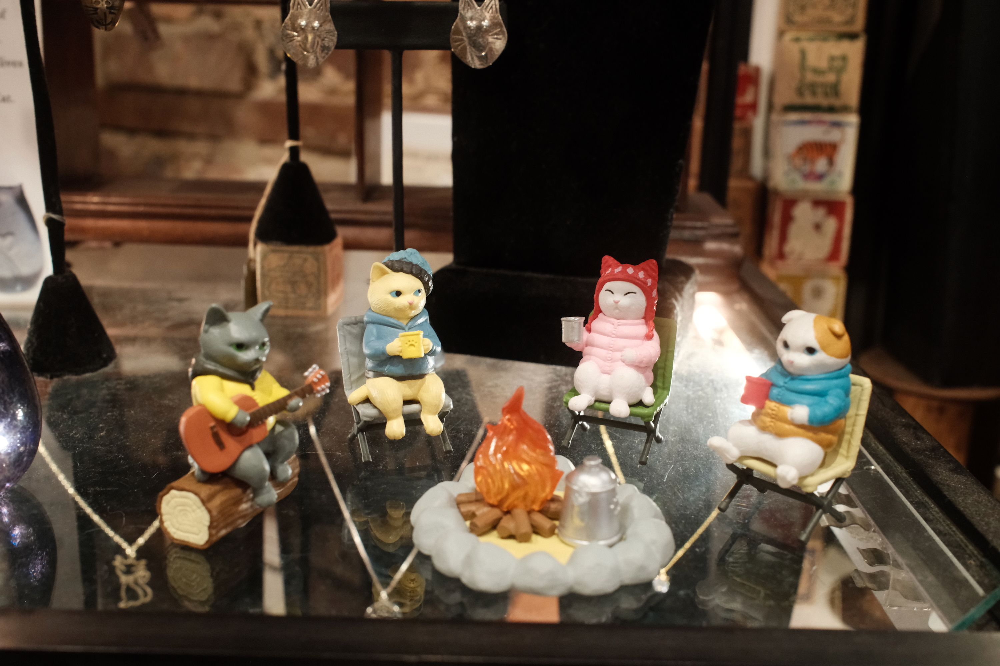
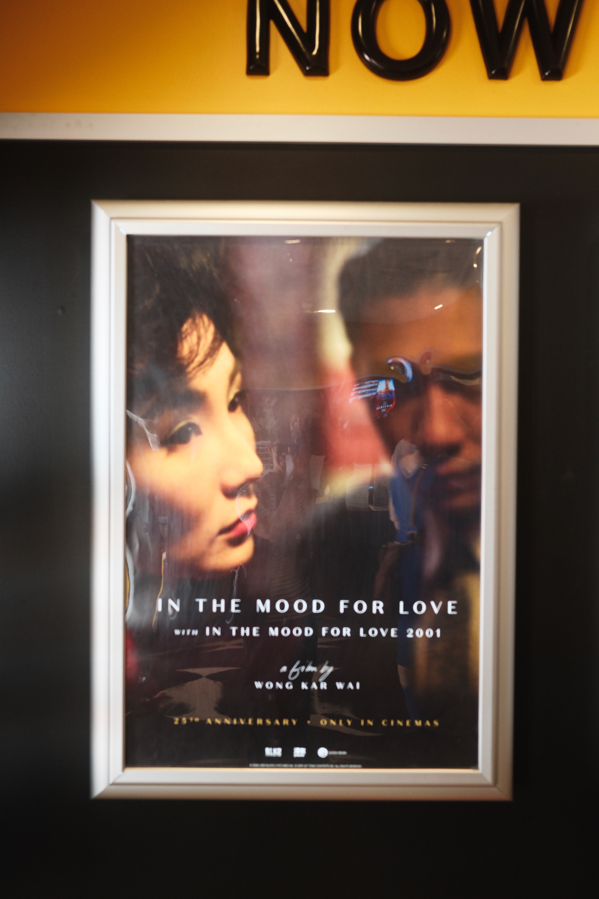
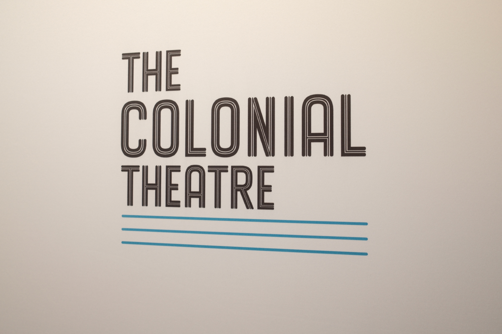
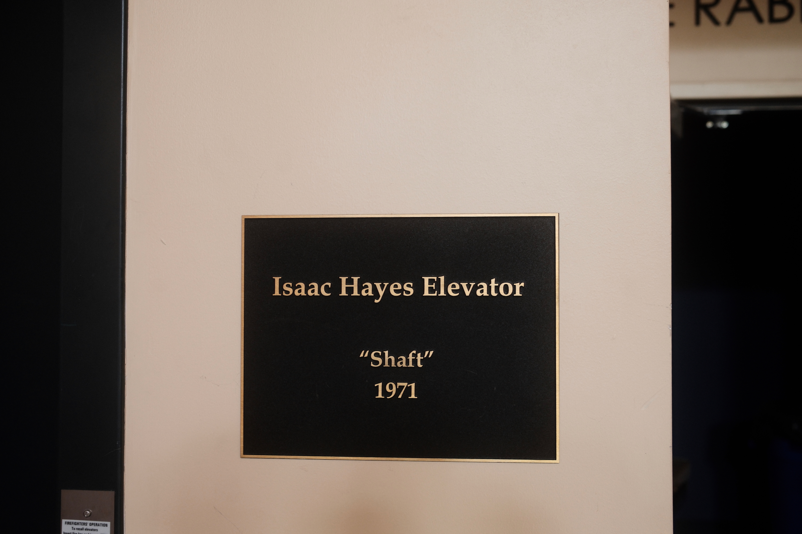
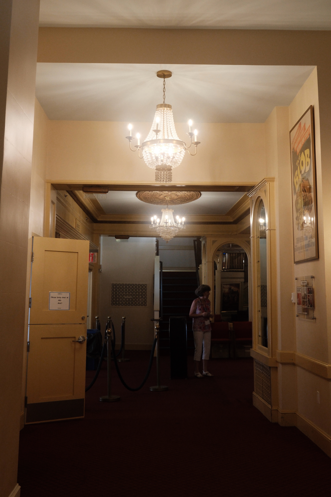
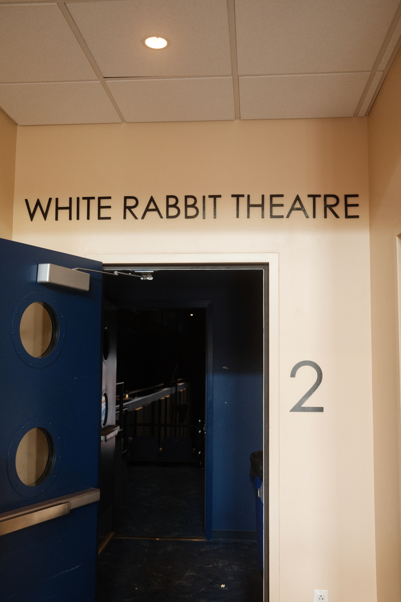

{.cinemascope}

In late September we hopped over to Phoenixville for a midday movie — the girls went to see *Superman (2025)* while Jordan and I went to a 25th anniversary screening of *In the Mood For Love*. It’s a movie I’ve seen multiple times, but this was my first time seeing it in a theater since its original release.

We dropped the kids off at the Colonial Theatre for their screening, then Jordan and I walked around downtown Phoenixville until our movie started.









{.cinemascope}

The Colonial Theatre is great — the programming is led by Dan Santelli, one of the former clerks from our now-closed video store, Viva Video. This was our first time actually seeing anything there.









{.cinemascope}





{.cinemascope}

More photos [on Flickr](https://flickr.com/photos/dirtystylus/albums/72177720329292313/).