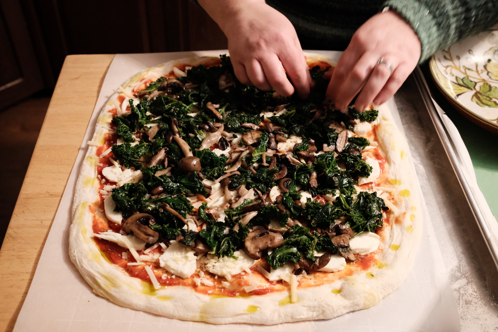
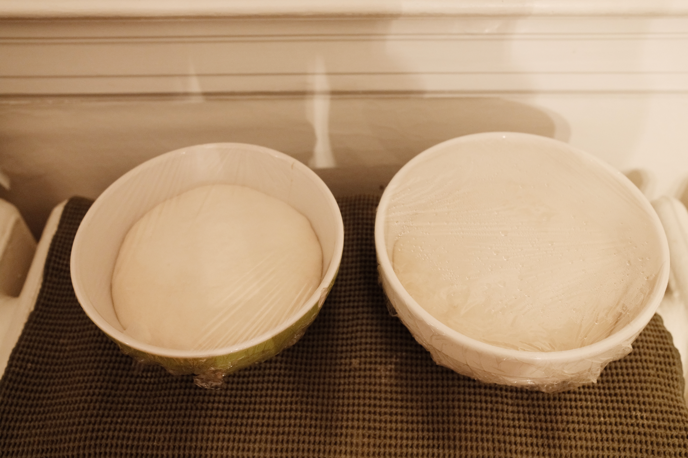
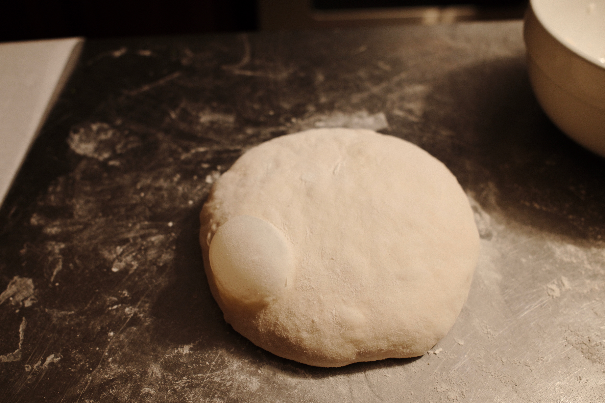
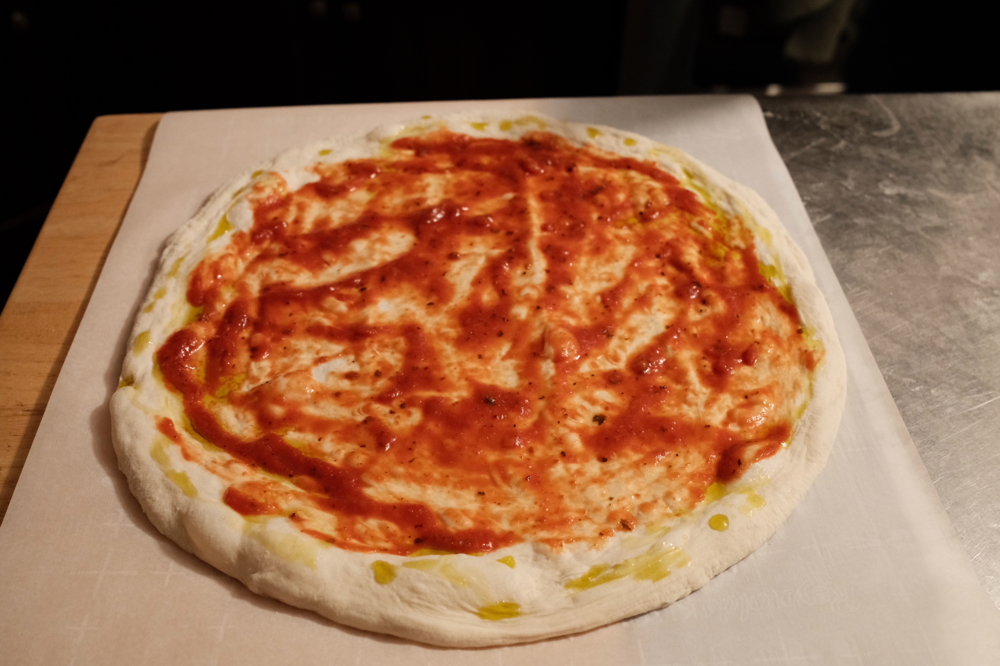
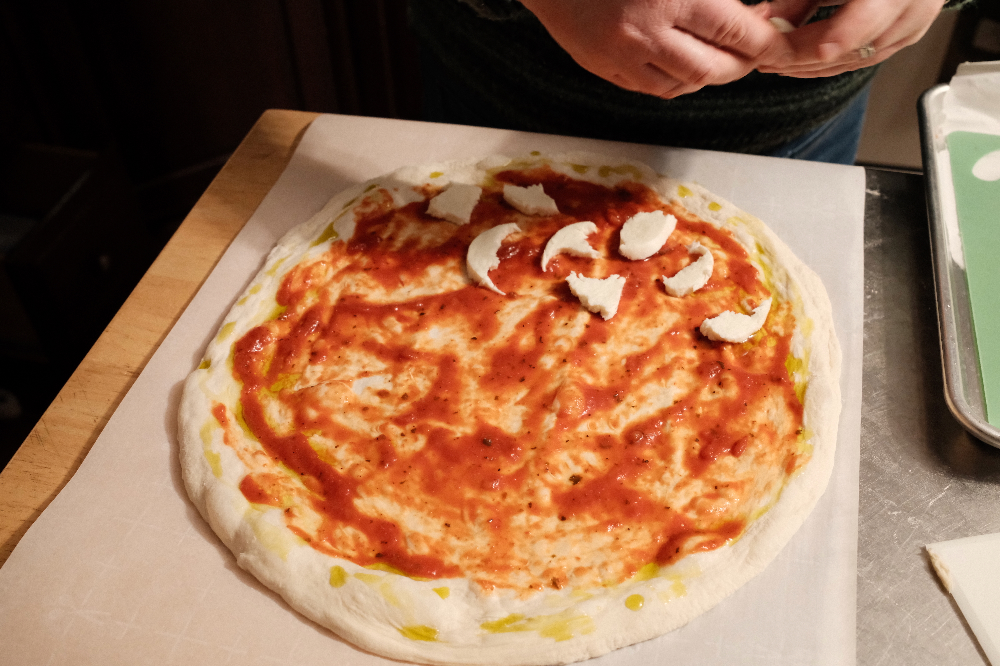
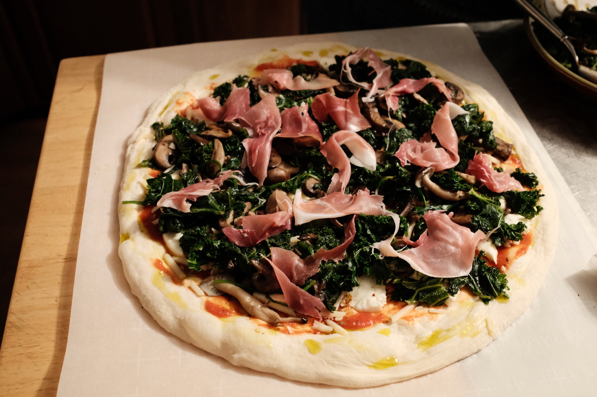
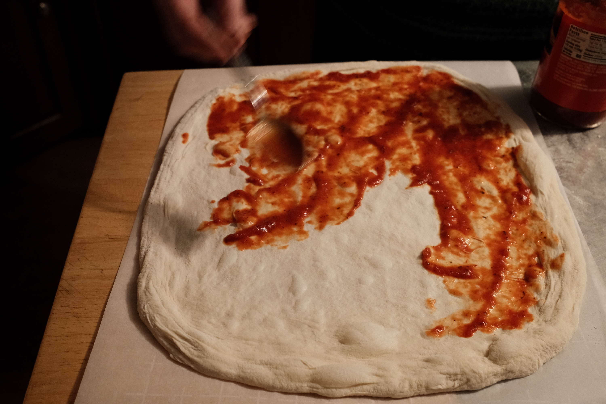

{.cinemascope}

Every other Sunday we make pizza. We don’t mess with the formula: overnight dough,^[We use a modified version of the NYT Cooking [no-knead bread](https://cooking.nytimes.com/recipes/11376-no-knead-bread).] fresh mozzarella (dried out beforehand), shredded parmesan, sauteed mushrooms and kale, prosciutto. Bake at 550º F, with a few minutes under the broiler at the end to get a little char.

We recently retired our pizza stone for a larger FibraMent 20"x15" baking stone, because our pies kept getting bigger and bigger as our kids got older and older.

(All photos taken with a Fujifilm X100VI, using the [Reggie Portra](https://fujixweekly.com/2022/06/11/fujifilm-x-trans-iv-film-simulation-recipe-reggies-portra/) film sim.)


* {.glightbox}
* {.glightbox}
* {.glightbox}
* {.glightbox}
* {.glightbox}
* {.glightbox}
* {.glightbox}
* {.glightbox}
* {.glightbox}


 
