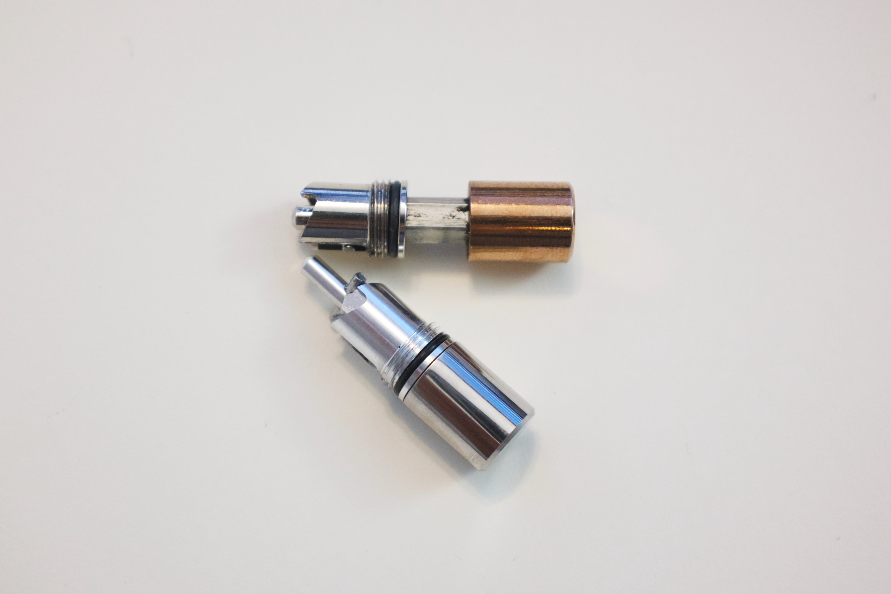

My older Studio Neat [Mark One](/posts/studio-neat-mark-one) was getting a bit long in the tooth—some of the Cerakote had chipped off, and the barrel was stained after it leaked into one of my bags.

I decided to pick up one of the newer colors—I really liked the new [green variant](https://www.studioneat.com/products/markone?variant=48537965003029) but it’s only offered with the silver knock. So I swapped in the knock from my white Mark One to create my desired Frankenpen™.

I continue to keep my eye on the periodic [limited edition](https://www.studioneat.com/products/limited) releases, but I missed out on the ones that really excited me, and the recent offerings have not been my style.
