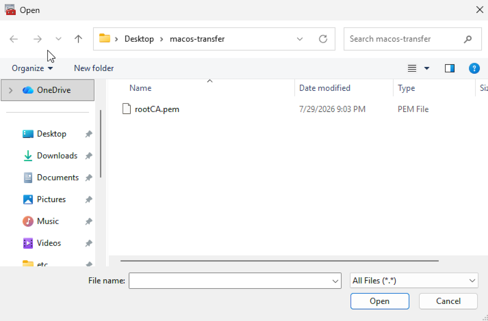

The past two years I’ve gotten deeper into the accessibility practice at [Upstatement](https://upstatement.com). All of our website projects go through an official accessibility audit, and I’ve gotten to run a bunch (and help remediate issues) on different projects across the agency. The constant practice has meant that I’ve gotten more and more comfortable with using a screen reader — I’m still slow, but I feel pretty good navigating through sites and elements.

For screen reader testing we typically use VoiceOver on macOS, which gives us most of the test coverage we need on our standard audit. On a recent project, however, we were implementing some particularly tricky carousels that did not get announced properly on Chrome + VoiceOver. Safari and Firefox announced things as expected, which matches the general consensus around macOS browser/VoiceOver combinations. It reinforced my feeling that I should be using NVDA as an additional screen reader check, since NVDA is the most common free screen reader out there.



Except: NVDA is PC-only. I’ve used remote testing using [Browserstack](https://www.browserstack.com) and [Assistiv Labs](https://assistivlabs.com), and those have been ok for checking the occasional thing, but I find them a bit slow for larger audits. So I decided to explore virtualization — back in the pre-Apple Silicon days I would run a Windows VM in [VirtualBox](https://www.virtualbox.org), but I was out of step with the current options. 

Hardware was the first blocker: my work laptop (a 16" MacBook Pro) only had 512GB of HDD capacity, something that was already eaten up by multiple DDEV sites. I ended up asking to trade in my laptop, stepping down to the 14" Pro, which felt like a better size/weight for me, anyway. I configured it with a 2TB SSD to give myself enough headroom for DDEV and a Windows VM. I’ll write a quick post about how I went about general setup for the Mac, but for the UTM/Windows/Chrome/NVDA bits I’ve jotted down some notes from my setup.



## UTM/Windows installation

This is a well-written how-to from James Jacobs: [Setting up Windows Screen Readers on a Mac](https://www.jamesjacobs.me/blog/setting-up-windows-screen-readers-on-a-mac/). I wasn’t familiar with [UTM](https://mac.getutm.app), but I’m glad there’s an open-source Mac-centric VM platform, after the bumpy path VirtualBox has taken post-Apple Silicon transition. The only wrinkle I encountered was that I forgot to hit `Enter` during the first Windows installation boot cycle, [ending up in a EFI shell](https://docs.getutm.app/guides/windows/#boots-into-efi-shell-instead-of-windows-installer). My other note is that you can technically install and run Windows 11 without a license key, although if you are finding that this setup works well I encourage you to purchase a license.

## NVDA and mapping keys

James also discusses keyboard configuration, specifically to map the `Insert` key that NVDA uses as a modifier key. I originally thought that this would not be an issue, because I mapped a key to act as `Insert` on my [external keyboards](/tags/keyboards/) using [VIA](https://usevia.app/). Except…it turns out that UTM has a documented issue where the `Insert` key [gets swallowed up](https://github.com/utmapp/UTM/issues/7118). 

Fine. So I decided to try `Caps Lock`, which you can specify as an alternate modifier key in NVDA. Well, UTM has issues there too, because it wants to synchronize `Caps Lock` state between the host Mac and the VM, and that prevents the actual key from getting passed through to UTM. You can set `Caps Lock` to be [treated as a key](https://docs.getutm.app/preferences/macos/#caps-lock-treated-as-a-key) but that might also leave your `Caps Lock` state out of sync between your host machine and the VM. 

What worked in the end was to do the key remapping on the *Windows* side, using [SharpKeys](https://apps.microsoft.com/detail/xpffcg7m673d4f).^[James mentioned key mapping in his blog post, but I skipped over it because I had an `Insert` key on my keyboard.] Using VIA I designated a `Page Down` key, which I rarely use. Then within Windows I used SharpKeys to map `Page Down` to `Insert`.

## Accessing DDEV sites from the Windows VM

At this point I could have stopped — I had Chrome + NVDA running, and the NVDA modifier key issue was fixed. However: a lot of my testing is done against sites running on local DDEV instances, and being able to test those from my Windows VM would be a nice treat.

Disclaimer: I ran into some roadblocks during different points of this configuration and couldn’t find a good guide on the open web, so I used an LLM to explain what might be happening. I figured I would atone by writing this blog post instead of telling people to ask Claude.

### IP

The first challenge was figuring out what IP address my host Mac was running on, and whether my Windows VM could see it.

In Windows I fired up PowerShell and ran:

```shell
ipconfig
```

Which gave me a default gateway with an IP address of `192.168.64.1`. So far, so good — Windows was at least able to see my Mac.

### DDEV



The next hurdle was making sure that DDEV would bind to an IP address accessible to outside requests. By default it seems that DDEV only binds to `localhost/127.0.0.1`, which cannot be accessed from outside.

`ddev config global --router-bind-all-interfaces` configures DDEV to bind the router to all network interfaces (0.0.0.0), not just localhost.

After a DDEV restart, `docker ps --filter "name=ddev-router" --format "{{.Ports}}"` confirmed that the DDEV site was being served up on `192.168.64.1` (note the first line showing `0.0.0.0`):

```unix
0.0.0.0:80->80/tcp,
[::]:80->80/tcp,
0.0.0.0:443->443/tcp,
[::]:443->443/tcp,
0.0.0.0:8025-8026->8025-8026/tcp,
[::]:8025-8026->8025-8026/tcp,
0.0.0.0:8142-8143->8142-8143/tcp,
[::]:8142-8143->8142-8143/tcp,
127.0.0.1:10999->10999/tcp
```



### Back to Windows

#### Hosts file configuration

With DDEV now routing to the Mac’s IP address, I added an entry for my DDEV domain in `C:\Windows\System32\drivers\etc\hosts`:

```yaml
192.168.64.1	[project name].ddev.site
```

#### SSL certificate

For extra credit, you can also copy the DDEV SSL certificate to Windows, so that it doesn’t throw a certificate warning when you access the site.

* On your Mac, Use `mkcert -CAROOT` to find the `rootCA.pem` file
* Copy that to your Windows VM (this was a helpful video: [Transferring files from macOS to Windows](https://www.youtube.com/watch?v=UogQu1S0p2Y))
* Add it to Windows’ Trusted Root Certification Authorities bucket using  the `certmgr.msc` program ([https://www.thewindowsclub.com/certmgr-msc-certificate-manager-windows](https://www.thewindowsclub.com/certmgr-msc-certificate-manager-windows)). (I had to make sure to set it to all files to see the pem file and import it.)



And…that’s it. That’s a long walk to get this all working, and I’m serious when I say you should probably get a cheap PC laptop, but it *can* be done.

