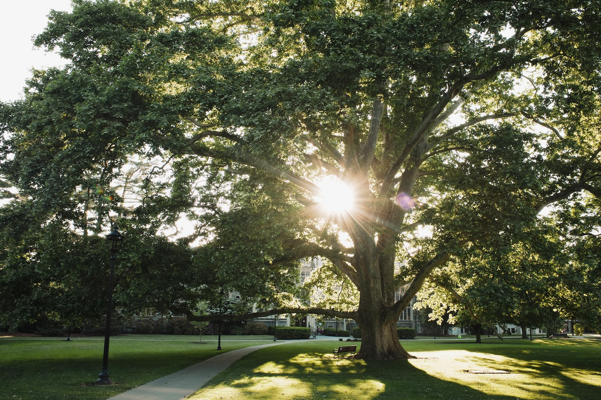
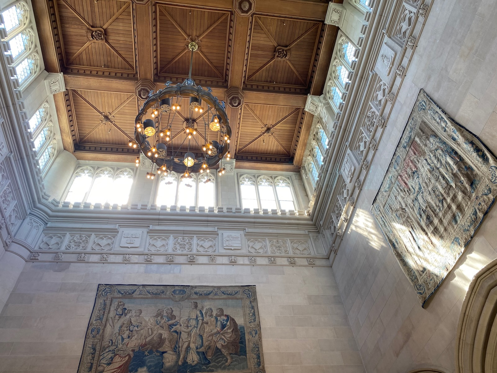
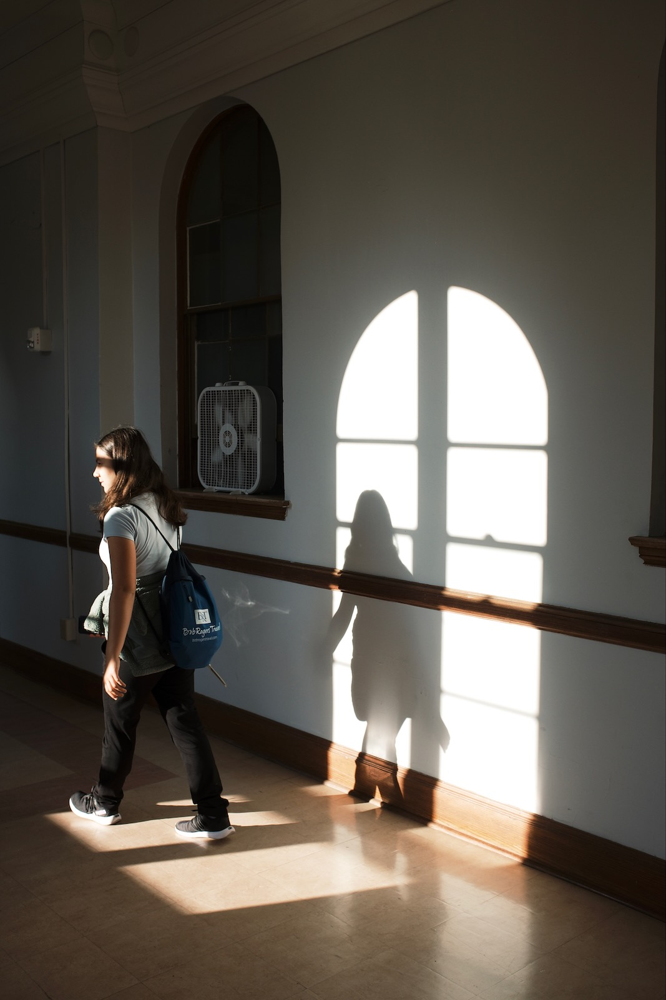
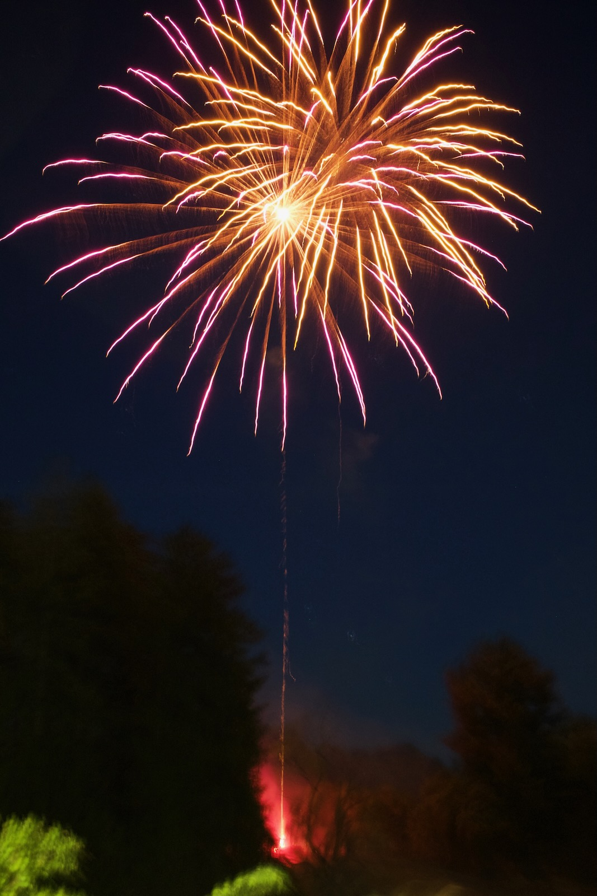
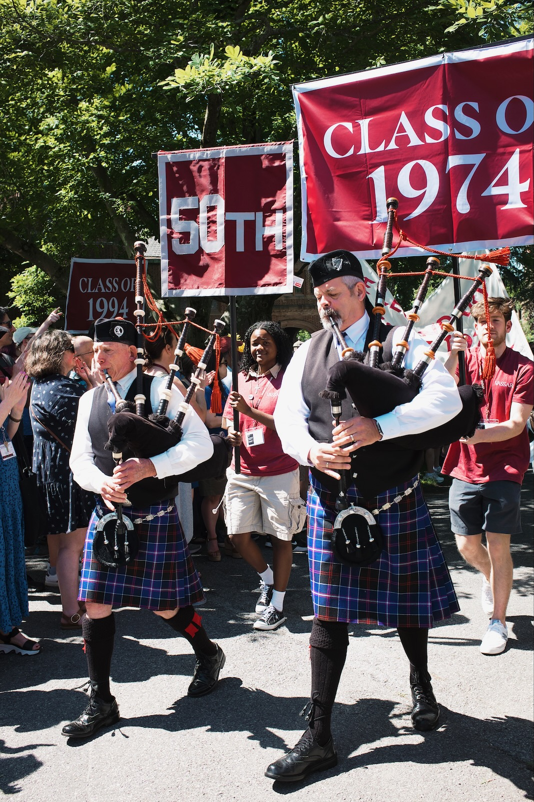
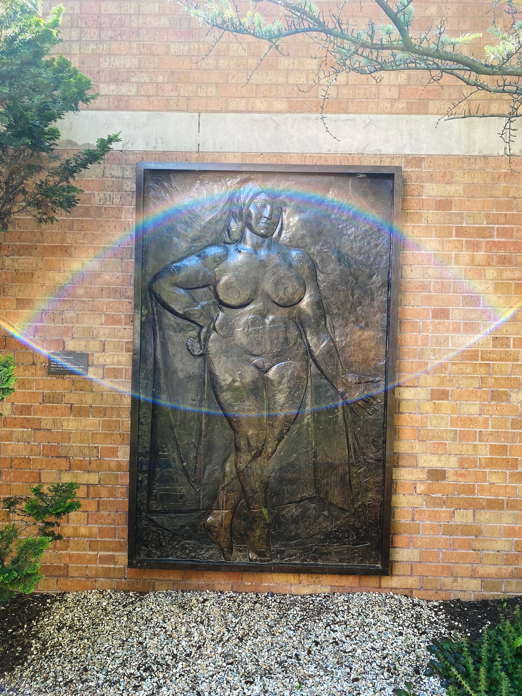

The family and I drove up to Vassar College two weeks ago for reunion weekend. We took our kids because we did the math and our eldest would *be* college-aged next time around, so it felt like the right moment to give them a look at a college campus. And let me say: the weather was perfect, and the campus looked glorious. 

{.cinemascope}

The light inside the library was pretty nice, too:

We enjoyed taking our kids to many of our old dorm rooms, which were mostly unchanged even as renovations have taken place around them.

The usual schedule held: fireworks on Friday night, the class parade on Saturday morning. There was a sizable group of pro-Palestine protesters urging Vassar alumni to put pressure on the college to call for a ceasefire, and disclose/divest from companies linked to Israel.

We took some time to check out the Loeb art museum on campus, including the sculpture garden. I particularly loved the afternoon light casting a rainbow flare on my phone’s camera.

[More photos on Flickr](https://www.flickr.com/photos/dirtystylus/albums/72177720317827503).