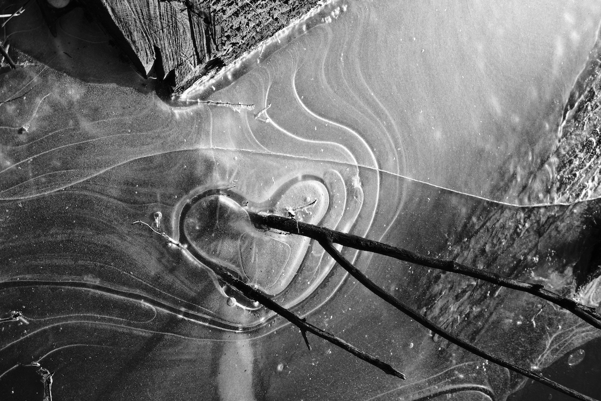
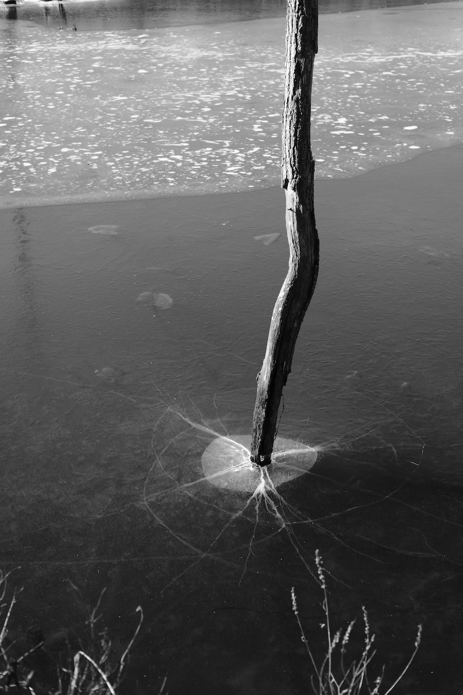
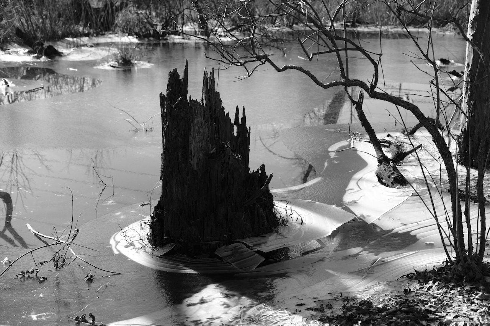
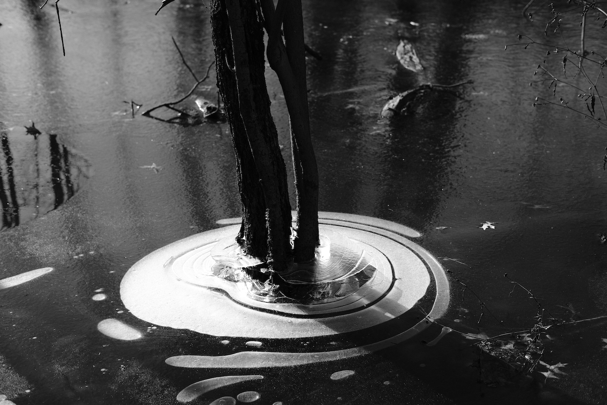
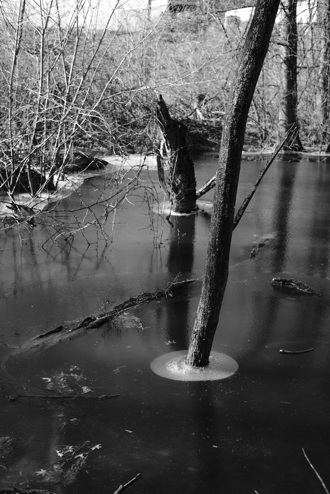
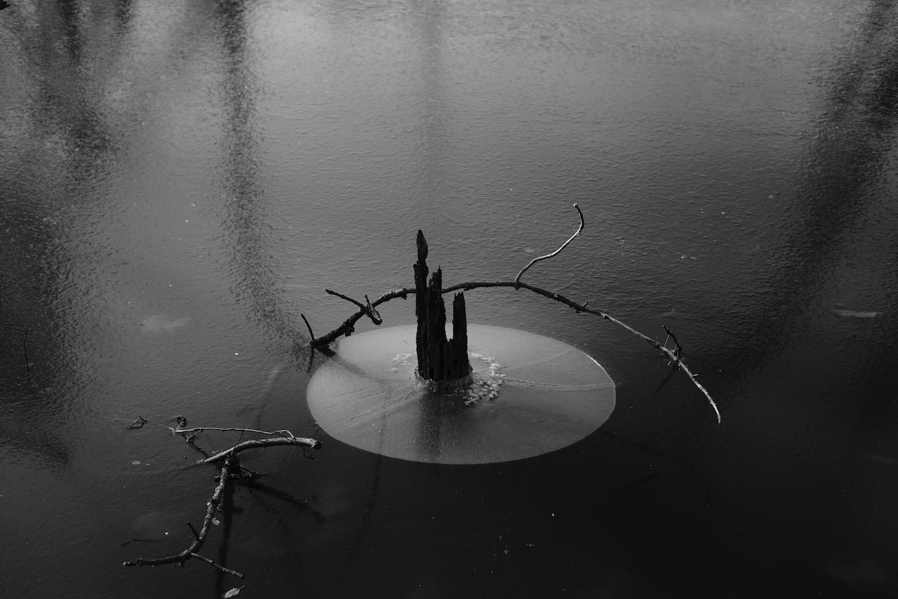
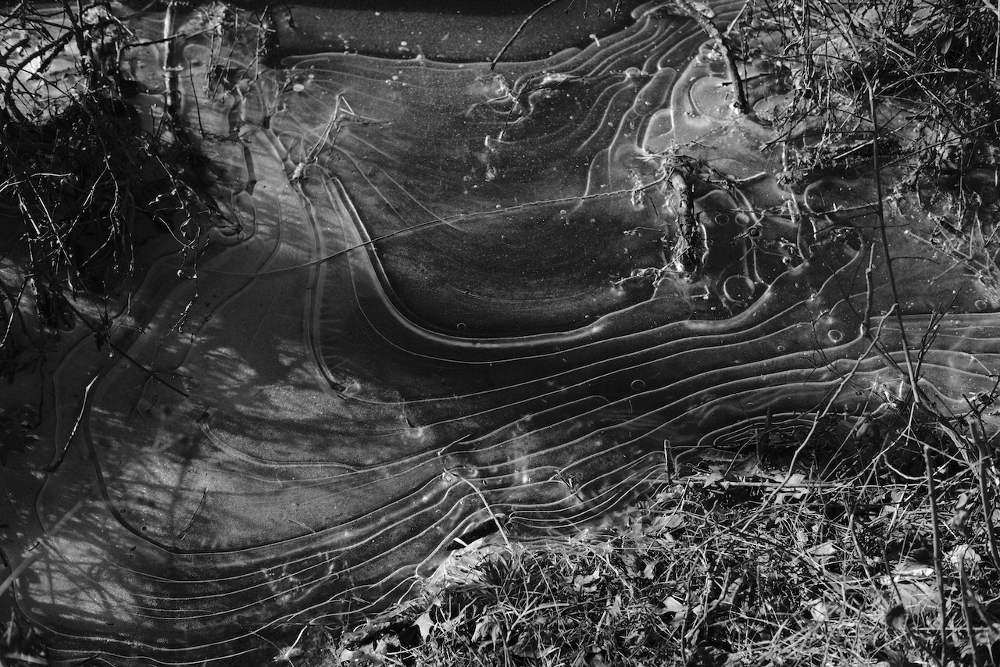
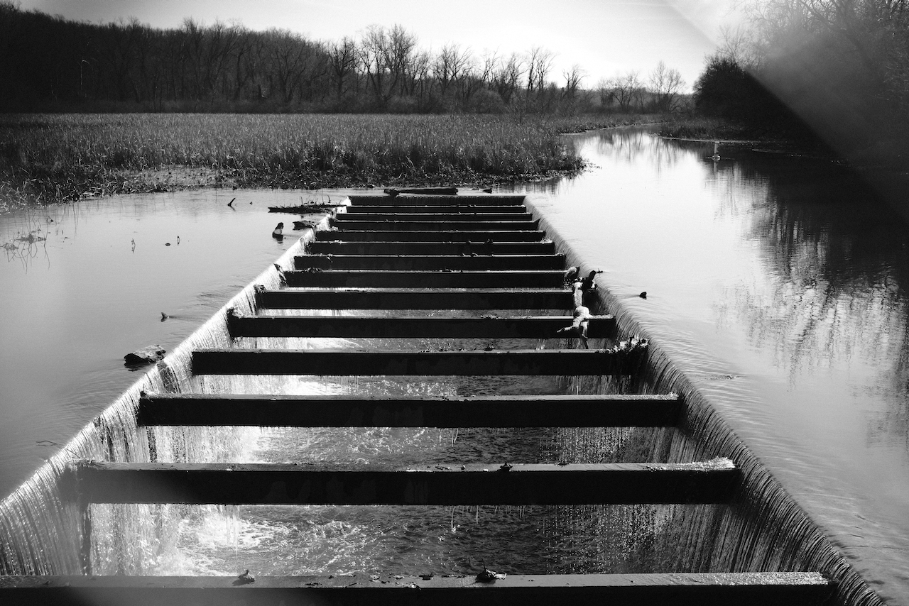
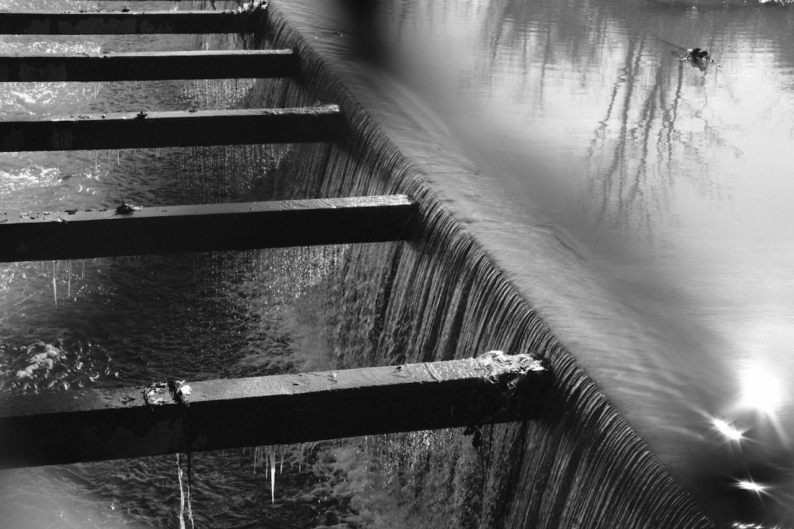

{.cinemascope}

The holidays were quiet; due to Covid-19 we elected not to visit family. Instead we celebrated at home, and scheduled an outdoor meeting at [Wildwood Lake](https://www.wildwoodlake.org) in Harrisburg, PA—which is roughly at the halfway point between our home and Jordan’s parents’. We took a walk around the lake, exchanged gifts, and drove back home.

The portion of the [Pennsylvania Canal](https://en.wikipedia.org/wiki/Pennsylvania_Canal) along the west side of the lake had partly frozen over, leading to some interesting patterns in the ice.

Taken with a Fujifilm X-T30 + 35mm/f2, Acros-R film sim.[^1]



- {.glightbox}
- {.glightbox}
- {.glightbox}
- {.glightbox}
- {.glightbox}
- {.glightbox}
- {.glightbox}
- {.glightbox}



[^1]: I’m trying out a new gallery system which uses [PhotoSwipe](https://photoswipe.com). If you notice any issues, please let me know.
